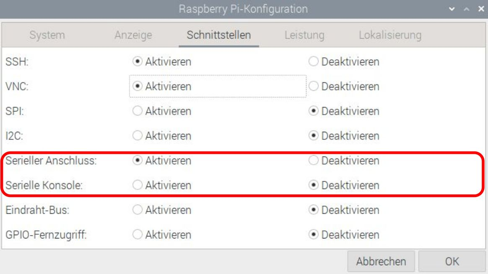

## Einleitung

Verwende LEGO® und den Raspberry Pi Build HAT, um einen Datenplotter zu bauen.

### Was du machen wirst

--- no-print ---

--- /no-print ---

--- print-only ---

--- /print-only ---

### Was du lernen wirst

+ Wie man Drehwinkel berechnet
+ Wie man Datenbereiche für die Visualisierung auf geeignete Skalen abbildet
+ Wie man bedingte Anweisungen (if/else) verwendet

### Hardware

+ Einen Raspberry Pi Computer
+ Ein Raspberry Pi Build HAT
+ Zwei LEGO® Technic™ Motoren
+ Einen LEGO® SPIKE™ Kraftsensor ODER ein Druckknopf, ein Steckbrett und Überbrückungsdrähte
+ Ein Sortiment von LEGO®-Teilen, einschließlich zweier kleiner Räder (wir haben eine Auswahl aus dem [LEGO® Education SPIKE™ Prime-Set verwendet](https://education.lego.com/en-gb/product/spike-prime))
+ Ein 7,5-V-Netzteil mit Hohlstecker (du könntest stattdessen ein Akkupaket verwenden, aber stelle sicher, dass alle Zellen vollständig geladen sind)

### Software

+ Python 3
+ Die Vcgencmd Python3-Bibliothek

### Downloads

+ [LEGO® SPIKE™ Prime Bauanleitungen: *Verfolge deine Pakete* (1/2)](https://le-www-live-s.legocdn.com/sc/media/lessons/prime/pdf/building-instructions/track-your-packages-bi-pdf-book1of2-05883f81fed73ac3738781d084e0d4e2.pdf){:target="_blank"}
+ [LEGO® SPIKE™ Prime Bauanleitungen: *Track Your Parcels* (2/2)](https://le-www-live-s.legocdn.com/sc/media/lessons/prime/pdf/building-instructions/track-your-packages-bi-pdf-book2of2-80dc3c8c61ec2d2ffa785b688326ef74.pdf){:target="_blank"}
+ [Fertiges Skript für den Lego Plotter](http://rpf.io/p/de-DE/lego-plotter-go){:target="_blank"}

--- collapse ---
---
title: Installation der Vcgencmd Python-Bibliothek
---

Stelle sicher, dass du mit dem Internet verbunden bist.

Öffne ein Terminal, indem du <kbd>Strg</kbd>+<kbd>Alt</kbd>+<kbd>T</kbd> auf deiner Tastatur drückst.

Gib an der Eingabeaufforderung `pip3 install vcgencmd` ein und drücke <kbd>Enter</kbd>.

Warte auf die Bestätigungsnachricht (es dauert nicht lange) und schließe dann das Terminalfenster.

--- /collapse --- 

--- collapse ---
---
title: Zusätzliche Informationen für Pädagogen
---

Sie können das fertige Projekt [hier](http://rpf.io/p/de-DE/projectName-get){:target="_blank"} herunterladen.

Wenn Sie dieses Projekt ausdrucken wollen, verwenden Sie bitte die [druckerfreundliche Version](https://projects.raspberrypi.org/de-DE/projects/projectName/print){:target="_blank"}.

--- /collapse ---

Bevor du beginnst, musst du deinen Raspberry Pi-Computer eingerichtet und deinen Build HAT aufgesteckt haben:

--- task ---

Montiere deinen Raspberry Pi mit M2-Schrauben und Muttern auf der LEGO Build Plate und stelle sicher, dass sich der Raspberry Pi auf der flachen Seite befindet:

 

--- /task ---

Die Montage des Raspberry Pi auf diese Weise ermöglicht einen einfachen Zugriff auf die Anschlüsse und den SD-Kartensteckplatz. Mit der Bauplatte kannst du den Raspberry Pi einfacher mit der Hauptstruktur deines Dashboards verbinden.

--- task ---

Richte den Build HAT mit dem Raspberry Pi aus und stelle sicher, dass du das Etikett `This way up` siehst. Achte darauf, dass alle GPIO-Pins vom Stecker des HAT bedeckt sind, und drücke ihn fest nach unten. (Das Beispiel verwendet einen [Stacking-Header](https://www.adafruit.com/product/2223){:target="_blank"}, der die Pins verlängert.)

 

--- /task ---

Jetzt solltest du deinen Raspberry Pi über die 7,5-V-Hohlstecker-Buchse des Build HAT mit Strom versorgen, damit du die Motoren verwenden kannst.

--- task ---

Wenn du dies noch nicht getan hast, richte deinen Raspberry Pi ein, indem du diesen Anweisungen folgst:

[Einrichten deines Raspberry Pi](https://projects.raspberrypi.org/de-DE/projects/raspberry-pi-setting-up){:target="_blank"}

--- /task ---

--- task ---

Nachdem der Raspberry Pi gebootet hat, öffne das Raspberry Pi Configuration Tool, indem du auf die Schaltfläche Raspberry Menu (Himbeere) klickst und dann „Einstellungen“ und dann „Raspberry Pi Konfiguration“ auswählst.

Klicke auf die Registerkarte "Schnittstellen" und passe die seriellen Einstellungen wie unten gezeigt an:

--- /task ---

--- task ---

Du musst auch die buildhat Python-Bibliothek installieren, indem du diese Anweisungen befolgst:

--- collapse ---
---
title: Installation der buildhat Python-Bibliothek
---

Öffne ein Terminalfenster auf deinem Raspberry Pi, indem du <kbd>Strg</kbd>+<kbd>Alt</kbd>+<kbd>T</kbd>drückst.

Gib an der Eingabeaufforderung `sudo pip3 install buildhat` ein

Drücke <kbd>Enter</kbd> und warte auf die Meldung "Installation abgeschlossen".

--- /collapse ---

--- /task ---
