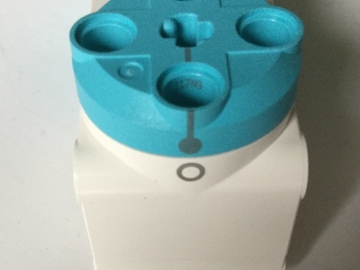

## Bewege die Motoren mit Daten

Vielleicht hast du in Erdbeben-Katastrophenfilmen eine Szene gesehen, in der ein [Seismograph](https://de.wikipedia.org/wiki/Seismograph) verwendet wird, um die Erschütterungen anzuzeigen. 

Der Aufbau solcher Geräte ist recht einfach: Ein Motor wird verwendet, um das Papier am Stift vorbei (die x-Achse) zu bewegen, während ein anderer Motor, rechtwinklig zum ersten, den Stift als Reaktion auf die sich ändernden Daten (y -Achse) bewegt. 

In diesem Projekt erstellest du einen Plotter aus LEGO® und verbindest ihn mit deinem Raspberry Pi, damit er Echtzeitdaten zeichnen kann.

--- task ---

Schließe einen Monitor, eine Tastatur und eine Maus an deinen Raspberry Pi an. Wenn du noch nie einen Raspberry Pi verwendet hast, solltest du mit [diesem Projekt](https://projects.raspberrypi.org/de-DE/projects/raspberry-pi-getting-started) beginnen.

Befestige den Build HAT an deinem Raspberry Pi (stelle sicher, dass das Raspberry Pi-Logo auf der Oberseite zu sehen ist) und schließe ein 7,5-V-Netzteil an die Hohlstecker-Buchse des Build HAT an. Dadurch wird dein Raspberry Pi gestartet.

--- /task ---

--- task ---

Öffne Thonny aus dem Programmiermenü und beginne dein Programm mit den folgenden Zeilen, die die Bibliotheken importieren, die du verwenden wirst:

--- code ---
---
language: python 
filename: plotter.py 
line_numbers: true 
line_number_start: 1
line_highlights: 1,2,3
---

from random import randint 
from time import sleep 
from buildhat import Motor

--- /code ---

Speichere dieses Programm als `plotter.py` indem du <kbd>Strg</kbd>+<kbd>s</kbd>drückst.

--- /task ---

--- task ---

Verwende nun die `randint` Funktion, um einen zufälligen Wert in einem Bereich (in diesem Fall -180 bis 180) zu erstellen und ihn in einer Variablen namens `winkel_neu` zu speichern:

--- code ---
---
language: python 
filename: plotter.py 
line_numbers: true 
line_number_start: 5
line_highlights: 5,6
---

winkel_neu = randint(-180,180) 
print(winkel_neu)

--- /code ---

--- /task ---

--- task ---

Führe dein Programm einige Male aus, indem du oben im Fenster auf die Schaltfläche **Run** klickst. In der Shell unter deinem Code sollten jedes Mal unterschiedliche Werte angezeigt werden.

--- /task ---

Anstatt dieses Skript manuell zu starten, schreib eine **Schleife**, um das Skript wiederholt auszuführen. Um die gleichen Zeilen kontinuierlich auszuführen, kannst du eine `while True:` Schleife verwenden.

--- task ---

Füge über dem soeben hinzugefügten Code eine Leerzeile ein, indem du <kbd>Enter</kbd> drückst.

Gib in dieser neuen Zeile `while True:` ein; Stelle sicher, dass du ein großes 'T' verwendest.

--- code ---
---
language: python 
filename: plotter.py 
line_numbers: true 
line_number_start: 5
line_highlights: 5
---

while True: 
    winkel_neu = randint(-180,180) 
    print(winkel_neu)

--- /code ---

--- /task ---

--- task ---

Füge am Anfang jeder der darunter liegenden Zeilen vier Leerzeichen hinzu, um einen **eingerückten Codeblock** zu erstellen. Dies teilt dem Computer mit, welche Zeilen in deiner Schleife enthalten sind.

--- code ---
---
language: python 
filename: plotter.py 
line_numbers: true 
line_number_start: 5
line_highlights: 6,7
---

while True: 
    winkel_neu = randint(-180,180) 
    print(winkel_neu)

--- /code ---

--- /task ---

--- task ---

Drücke am Ende deines Codes <kbd>Enter</kbd>, um eine weitere eingerückte Zeile hinzuzufügen. Schreib `sleep(0.1)` in diese Zeile.

--- code ---
---
language: python 
filename: plotter.py 
line_numbers: true 
line_number_start: 5
line_highlights: 8
---

while True: 
    winkel_neu = randint(-180,180) 
    print(winkel_neu) 
    sleep(0.1)

--- /code ---

--- /task ---

--- task ---

Führe deinen Code aus, und sieh dir in der Shell die Reihe von Werten an. Wenn du Fehler erhältst, überprüfe, ob dein Code wie folgt aussieht:

--- code ---
---
language: python 
filename: plotter.py 
line_numbers: true
line_number_start: 1
---

from random import randint 
from time import sleep 
from buildhat import Motor

while True: 
    winkel_neu = randint(-180,180) 
    print(winkel_neu) 
    sleep(0.1)

--- /code ---

--- /task ---

Nachdem du nun einige Daten hast, kannst du diese verwenden, um die Position eines Motors zu steuern.

--- task ---

Schließe einen LEGO® Technic™ Motor an Port A des Build HAT an. Füge der Motorachse einige zusätzliche LEGO-Elemente hinzu, damit die Bewegungen leicht zu sehen sind.

--- /task ---

--- task ---

Richte das Element mit der Strichmarkierung am Motor aus und stelle den Motor dann in die Nullposition:

--- /task ---

Ändere nun den Hauptteil deines Programms so, dass der vom Motor gedrehte Winkel dem neuesten Wert deines simulierten Sensors entspricht.

Dazu musst du deinen Motor so einrichten, dass das Programm darauf zugreifen kann.

--- task ---

Erstelle ein Objekt `motor_y` am Anschluss `A` auf dem Build HAT. Drehe dann den Motor zur `0` Position mit einer Geschwindigkeit von `100`.

--- code ---
---
language: python 
filename: plotter.py 
line_numbers: true 
line_number_start: 4
line_highlights: 5, 6
---

motor_y = Motor('A') 
motor_y.run_to_position(0, 100)

--- /code ---

--- /task ---

--- task ---

Die nächste Zeile lässt den Motor um diesen Winkel drehen, der in `winkel_neu` gespeichert ist.

--- code ---
---
language: python 
filename: plotter.py 
line_numbers: true 
line_number_start: 7
line_highlights: 11
---

while True: 
    winkel_neu = randint(-180,180) 
    print(winkel_neu) 
    motor_y.run_to_position(winkel_neu, 100)

--- /code ---

--- /task ---

--- task ---

Klicke auf **Run** und du solltest sehen, wie sich dein Motor als Reaktion auf die sich ändernden Daten wie ein Uhrzeiger in verschiedene Positionen dreht. Wenn du das Programm erneut ausführst, sollte es die Motorposition auf `0` zurücksetzen, bevor er sich erneut zufällig bewegt.

Wenn du Fehler erhältst, überprüfe, ob dein Code wie folgt aussieht.

--- code ---
---
language: python 
filename: plotter.py 
line_numbers: true
line_number_start: 1
---

from random import randint 
from time import sleep 
from buildhat import Motor

motor_y = Motor('A') motor_y.run_to_position(0, 100)

while True: 
    winkel_neu = randint(-180,180) 
    print(winkel_neu) 
    motor_y.run_to_position(winkel_neu, 100) 
    sleep(0.1)

--- /code ---

--- /task ---

--- save ---
