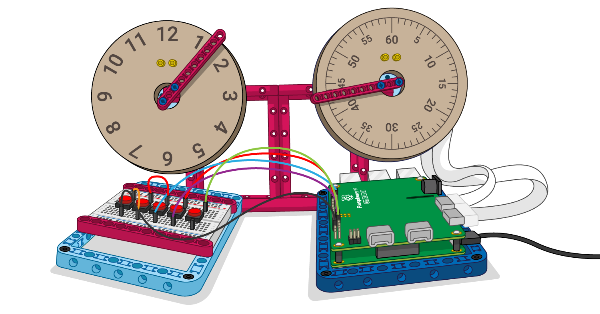

## Wie geht es weiter?

+ Füge einen LEGO® Technic™ Farbsensor hinzu, um zu erkennen, wenn das Papier aufgebraucht ist.

+ Ändern Sie den Code des LEGO® Technic™ Kraftsensors so, dass die Geschwindigkeit des Motors, der den Papiereinzug steuert, durch Erhöhen des Drucks auf den Sensor erhöht wird.

+ Fügen Sie andere Datenquellen hinzu. Du könntest einen anderen externen Sensor oder einen einen Online-Datenstrom als Datenquelle verwenden.

Wenn du dem Weg [Einführung in LEGO BuildHAT](https://projects.raspberrypi.org/en/pathways/lego-intro) folgst, kannst du mit dem [LEGO Armaturenbrett](https://projects.raspberrypi.org/en/projects/lego-data-dash) Projekt fortfahren. In diesem Projekt wirst du einige Zifferblätter und Anzeigen mit LEGO erstellen und sie dazu bringen, die Luftqualitätsdaten von einem beliebigen Ort auf der Welt anzuzeigen!

Wenn du mehr Spaß beim Erkunden von Python haben willst, dann könntest du einige [dieser Projekte](https://projects.raspberrypi.org/en/projects?software%5B%5D=python) ausprobieren.
