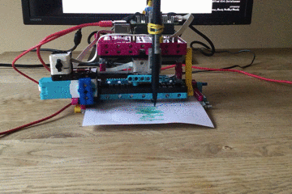

## Introduction

Use LEGO® and the Raspberry Pi Build HAT to create a data plotter. 

### What you will make

--- no-print ---

--- /no-print ---

--- print-only ---

--- /print-only ---

### What you will learn

+ How to calculate angles of rotation
+ How to map data ranges onto appropriate scales for visualisation
+ How to use conditional statements (if/else)

### Hardware

+ A Raspberry Pi computer
+ A Raspberry Pi Build HAT
+ Two LEGO® Technic™ motors
+ A LEGO® SPIKE™ Force Sensor OR a push button, breadboard, and jumper wires
+ Assortment of LEGO®, including two small wheels (we used a selection from the [LEGO® Education SPIKE™ Prime
 kit](https://education.lego.com/en-gb/product/spike-prime))
+ A 7.5V power supply with a barrel jack (you could instead use a battery pack, but make sure that all cells are fully charged) 

### Software

+ Python 3
+ The Vcgencmd Python3 library

### Downloads

+ [LEGO® SPIKE™ Prime building instructions: *Track Your Parcels* (1/2)](https://le-www-live-s.legocdn.com/sc/media/lessons/prime/pdf/building-instructions/track-your-packages-bi-pdf-book1of2-05883f81fed73ac3738781d084e0d4e2.pdf){:target="_blank"}
+ [LEGO® SPIKE™ Prime building instructions: *Track Your Parcels* (2/2)](https://le-www-live-s.legocdn.com/sc/media/lessons/prime/pdf/building-instructions/track-your-packages-bi-pdf-book2of2-80dc3c8c61ec2d2ffa785b688326ef74.pdf){:target="_blank"}
+ [Finished script for Lego Plotter](http://rpf.io/p/en/lego-plotter-go){:target="_blank"}

--- collapse ---
---
title: Install the Vcgencmd python library
---
Make sure you are connected to the internet.

Open the terminal on your Raspberry Pi by pressing <kbd>Ctrl</kbd>+<kbd>Alt</kbd>+<kbd>T</kbd> on your keyboard.

At the prompt type: `pip3 install vcgencmd` and press <kbd>Enter</kbd>.
 
Wait for the confirmation message (it won't take long) then close the terminal window.

--- /collapse --- 

--- collapse ---
---
title: Additional information for educators
---

You can download the completed project [here](http://rpf.io/p/en/projectName-get){:target="_blank"}.

If you need to print this project, please use the [printer-friendly version](https://projects.raspberrypi.org/en/projects/projectName/print){:target="_blank"}.

--- /collapse ---
