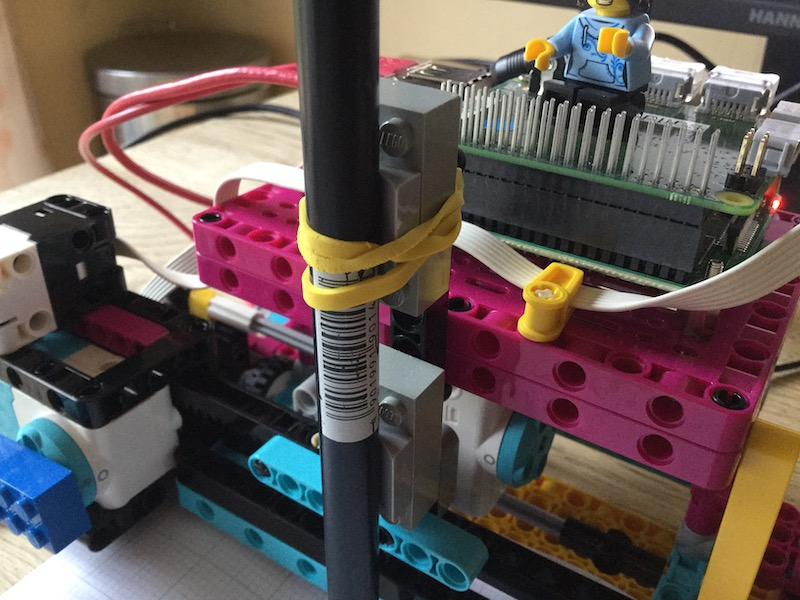

## Introduction

Use LEGO and the Raspberry Pi Build HAT to create a data plotter. 

### What you will make

--- no-print ---

--- /no-print ---

--- print-only ---

--- /print-only ---

--- collapse ---
---
title: What you will need
---
### Hardware

+ A Raspberry Pi computer
+ A Raspberry Pi Build HAT
+ Two LEGO Technic motors
+ A LEGO Technic Force sensor 
OR
+ A push button, breadboard and jumper wires
+ Assortment of LEGO, including two small wheels. We used a selection from the [LEGO Spike Prime kit](https://education.lego.com/en-gb/product/spike-prime)
+ A 9v power supply with a barrel jack. This can be a battery pack, but make sure that all cells are fully charged. 

### Software

+ Python 3
+ The Vcgencmd Python3 library:
Install on your Raspberry Pi with
`sudo pip3 install vcgencmd`

### Downloads

+ [LEGO Spike Prime Building instructions: Track your parcels 1/2](https://le-www-live-s.legocdn.com/sc/media/lessons/prime/pdf/building-instructions/track-your-packages-bi-pdf-book1of2-05883f81fed73ac3738781d084e0d4e2.pdf)
+ [LEGO Spike Prime Building instructions: Track your parcels 2/2](https://le-www-live-s.legocdn.com/sc/media/lessons/prime/pdf/building-instructions/track-your-packages-bi-pdf-book2of2-80dc3c8c61ec2d2ffa785b688326ef74.pdf)

--- /collapse ---

--- collapse ---
---
title: What you will learn
---

+ Learning objective 1
+ How to map data ranges onto appropriate scales for visualisation
+ Learning objective 3

--- /collapse ---

--- collapse ---
---
title: Additional information for educators
---

You can download the completed project [here](http://rpf.io/p/en/projectName-get){:target="_blank"}.

If you need to print this project, please use the [printer-friendly version](https://projects.raspberrypi.org/en/projects/projectName/print){:target="_blank"}.

--- /collapse ---
