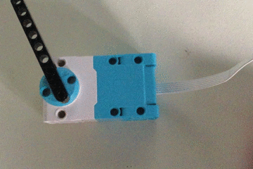

## Simulated data

Before you use your plotter to record real data, let's test it with some simulated measurements.

--- task ---

Connect a monitor, keyboard and mouse to your Raspberry Pi. If you've never used a Raspberry Pi before, you might want to start with [this project](https://learning-admin.raspberrypi.org/en/projects/raspberry-pi-getting-started).

Attach the Build HAT to your Raspberry Pi and connect a 7.5v power supply to the barrel jack of the BuildHAT. 
--- /task ---

--- task ---

Open Thonny and add the following lines to begin your program by importing the libraries you will be using:

```python
from random import randint
from time import sleep
from buildhat import Motor
```
Save this program as plotter.py

--- /task ---

--- task ---

Now you can use the `randint` function to create a random value between a pre-defined range (in this case 0 to 360) and store it in a variable:

```python
sensor_data = randint(0,360)
print(sensor_data)
```

--- /task ---

If you run that program you should see a single integer value displayed. Run it again and you should gt a different value.

--- task ---

Now if you wrap those lines in a loop you should be able to create a simulated data source that produces a new value every 10th of a second.

--- hints ---
--- hint ---
To run the same lines continuously you can use a `while True:` loop
--- /hint ---
--- hint ---
To set the time between each value being generated, you can use `sleep(0.1)` tp pause for a 10th of second (0.1 seconds) in between each iteration.
--- /hint ---
--- hint ---
Your modified program should look this this (with the `import` lines at the top)

```python
while True:
    sensor_data = randint(0,360)
    print(sensor_data)
    sleep(0.1)
```
--- /hint ---
--- /hints ---
--- /task ---

Now we have some reliable data, we can use this to control the position of a motor.

--- task ---
Connect a LEGO Technic motor to port A on the Build HAT. Add some additional LEGO elements to the motor axle so that it is easy to see the motor turning (a ling straight piece works well as a pointer). Line up the element with the line mark on the motor and then set the motor to the zero position


--- /task ---

--- task ---
Modify the main body of your program so that angle turned to by the motor is the same as the latest value produced by our simulated sensor. You can probably see that the choice of range for the values was important.

```python

motor_y = Motor('A')
motor_y.run_to_position(0, 100)
while True:
    sensor_data = randint(0,360)
    print(sensor_data)
    motor_y.run_to_position(sensor_data, 100)
    sleep(0.1)
```
--- /task ---

You should see your motor spin clockwise to different positions in response to the changing data. If you run the program again it should initially reset the motor position back to 0 before following the simulated data values. 


The second parameter passed to the `run_to_position()` function sets the speed at which the motor moves (100 is the fastest). When the plotter is in action you will want the trace to respond quickly to changes in data so it will need to move as quickly as possible.

You may have noticed that at the moment your motor will always take the shortest path to the new position. So for example if the motor is at 300 degrees and the next position is 10 degrees, it will travel in a clockwise direction, passing through the zero position in order to get to its destination as quickly as possible. This is fine for our simulation, but our plotter will not have this freedom of movement. Once the pen has reached the top of bottom of the paper (y-axis) it cannot continue to travel up to emerge at the bottom like a Pac-man leaving the maze at the top and re-appearing at the bottom.


So your plotter will always need to be prevented from travelling clockwise past the zero mark.  This can be achieved by altering the behaviour of the motor when moving to a position. By passing an additional `direction=` parameter to the `run_to_position()` function. Setting this value to `0` will force the motor to move clockwise while a value of `1` will drive it anti-clockwise (a value of `2` selects the default 'shortest path' behaviour).



So for example:
```python
motor_y.run_to_position(50,100,direction=1)
```
Will drive a motor to 50 degrees position, turning anti-clockwise at maximum speed

--- task ---

Add a conditional check to your loop to ensure that the motor never never passes through zero degrees and always moves from a higher angle to a lower one by turning in an anti-clockwise direction. 

--- hints ---
--- hint ---
You can store the last position in a variable at the end of the loop and use that at the start of loop to see if the new position is greater or smaller than the preceding one. 
```python
last_value = sensor_data
```
--- /hint ---
--- hint ---
Carry out this check using an `if` conditional:
```python
if sensor_data < last value:
    # move anit-clockwise
else:
    # move clockwise
```
--- /hint ---
--- hint ---
Your modified program should look this this (with the `import` lines and BuildHAT setup at the top). Note that you need set the `last_value` to be the start position (in this case, 0) before the `while` loop. 

```python
last_value = 0
while True:
    sensor_data = randint(0,360)
    print(sensor_data)
    if sensor_data < last value:
        motor_y.run_to_position(sensor_data, 100, direction=1) # move anit-clockwise
    else:
        motor_y.run_to_position(sensor_data, 100, direction=0) # move clockwise
    sleep(0.1)
```
--- /hint ---
--- /hints ---
--- /task ---


This approach will be fine for a data source that only ever produces positive values. How about data which might also have values less than zero (e.g. temperature, acceleration)?

--- task ---
Modify the main body of your program so that the data produced can be either positive or negative, but has the same overall difference between minimum and maximum values. 

--- hints ---
--- hint ---
Currently the random values can be between 0 and 360, always positive. To keep the same difference between maximum and minimum while producing negative values you should change you code so that the values generated are between -180 and +180.
--- /hint ---
--- hint ---
You need to adjust the parameters passed to the `randint()` function.
--- /hint ---
--- hint ---
Change the line to be 
```python

    sensor_data = randint(-180,180)

```
--- /hint ---
--- /hints ---
--- /task ---

Run your program again. This time the motor should swing both clockwise and anti-clockwise depending on the sign of the simulated data. 

The conditional test we created previously should still work. Now it will be preventing the motor from turning from a negative value to a positive one *without* passing through zero (and vice versa).

--- save ---