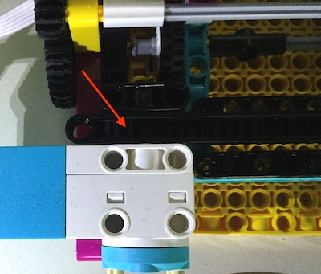
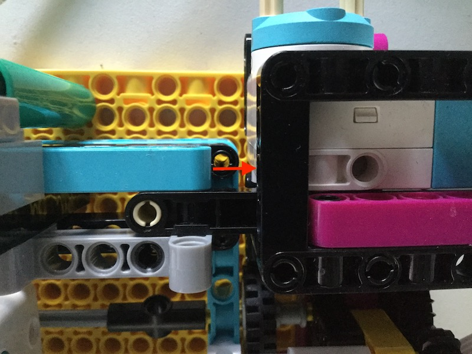

## Building the plotter

Nowadays when data is collected from a sensor, it is typically uploaded to an online dashboard. However this requires a reliable connection to the Internet which may not always be available if your sensor is located in a hut half way up a volcano or out on your school playing field. One solution is to record the data directly onto a very long roll of paper and this was a technique you may have seen in eartyhquake disaster movies where a [seismometer](https://en.wikipedia.org/wiki/Seismometer) is used to show the impending tremors. 

The design of such devices is quite simple: one motor is used to move the paper across the pen (the x-axis) while another at right angles to the first, moves the pen up and down in response to the changing data (y-axis). 

--- task ---
In this first step you will build a simple x/y plotter using LEGO. 

There are plenty of ways you could do this, but the build instructions for the LEGO Spike Prime Track Your Parcels project are a great starting point. You can use the motor from the previous step for the y-axis motor (the one holding the pen) in the build. 

[Part one](https://le-www-live-s.legocdn.com/sc/media/lessons/prime/pdf/building-instructions/track-your-packages-bi-pdf-book1of2-05883f81fed73ac3738781d084e0d4e2.pdf) shows you how to construct the base and the arm that will hold the pen.


--- /task ---

--- task ---
You will need to adapt the build slightly so that the arm is able to hold a pen. Rubber bands are a great way to hold a pen snugly against LEGO.

--- /task ---

--- task ---
Then [part 2](https://le-www-live-s.legocdn.com/sc/media/lessons/prime/pdf/building-instructions/track-your-packages-bi-pdf-book2of2-80dc3c8c61ec2d2ffa785b688326ef74.pdf) complets the mechanism that uses the two motors to brive the plotter.


--- /task ---

Now you can use your simulated data source to test your plotter. For now, keep the lid on your pen or remove it all together while you observe the motion caused by the data.

### Calibrating the plotter

Your program currently allows the motor to move through its full range of motion (-180 to +180 degrees from the zero point). But the physical constraints of the plotter mean that if we tried to drive the motor to its maximum and minimum positions, it would crash the pen arm into other parts of the build.

--- task ---

Click into the Shell (REPL) pane of Thonny so that we can execute Python one line at a time. 

Enter these lines into the shell (you can just copy-and-paste them from your program above):

```python
>>> from build_hat import BuildHAT
>>> bh=BuildHAT()
>>> motor_y = bh.port.A.motor
>>> motor_y.run_to_position(0, 100)
```

Then re-enter the last line, but with a non-zero value for the position parameter:

```python
>>> motor_y.run_to_position(10, 100)
```

The pen arm should move up away from the motor.

Keep increasing this position value in small intervals until the arm apporachs the limit of how far in can travel or the position value reaches 350 degrees.

In the positive y direction, you need to make sure that enough of the toothed bar remains in contact with the the black cog on which it sits. 




Make a note of the maximum safe position value for positive (clockwise) movement. 
--- /task ---

 In the opposite (negative y) direction, the limit to movement is set by the light blue bar that sits below the pen.

 
--- task ---

Repaet the calibration process in the negative y direction. This time when you incrementally move the arm anticlockwise, you'll need to include the direction parameter:

```python
>>> motor_y.run_to_position(-50, 100, direction=1)
```

Once again, make a note of the maximum negative (anticlockwise) direction that it is safe to move the plotter arm to.

--- /task ---

If you have followed the build instructions from the Track my Parcel project above, you should find the limits to be around 350 degrees positive, and -170 degrees negative. 

Now you can move on adding a real data source. 

--- save ---