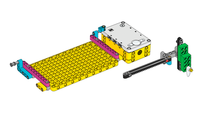

## Building the plotter

Nowadays when data is collected froma sensor, it is typically uploaded to an online dashboard. However this requires a reliable connection to the INternet which may not always be available, if your sensor is located in a hut half way up a volcano or out on your school playing field. One solution is to record the data directly onto a very long roll of paper and this was a technique you may have seen in eartyhquake disaster movies where a [seismometer](https://en.wikipedia.org/wiki/Seismometer) is used to show the impending tremors. 

The design of such devices is quite simple: one motor is used to move the paper across the pen (the x-axis) while another at right angles to the first moves the pen up and down in response to the changing data. 

--- task ---
In this first step you will build a simple x/y plotter using LEGO. 

There are plenty of ways you could do this, but the build instructions for the LEGO Spike Prime Track Your Parcels project are a great starting point. 

[Part one](https://le-www-live-s.legocdn.com/sc/media/lessons/prime/pdf/building-instructions/track-your-packages-bi-pdf-book1of2-05883f81fed73ac3738781d084e0d4e2.pdf) shows you how to construct the base and the arm that will hold the pen.

--- /task ---

--- task ---
You will need to adapt the build slightly so that the arm is able to hold a pen. Rubber bands are a great way to hold a pen snugly against LEGO.

--- /task ---

--- task ---
Then [part 2](https://le-www-live-s.legocdn.com/sc/media/lessons/prime/pdf/building-instructions/track-your-packages-bi-pdf-book2of2-80dc3c8c61ec2d2ffa785b688326ef74.pdf) complets the mechanism that uses the two motors to brive the plotter.

--- /task ---

--- task ---

Step content...

--- /task ---

--- save ---