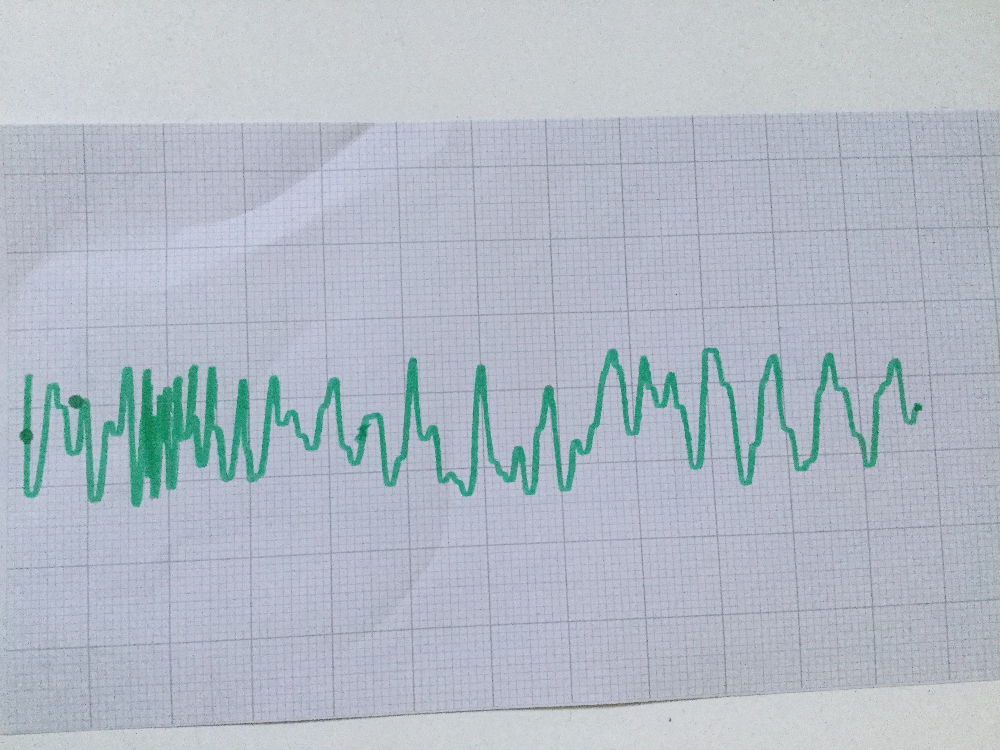

## Paper feeding and button control

These are the final touches need to make a usable, controllable paper plotter. 

### Paper feeding

Once you're happy that this is working as you'd expect, add a sheet of paper underneath the small wheels and then modify you program to slowly turn these wheels as measurements are recorded.

--- task ---
Plug the large Technic motor (which drives these wheels) into port B on the BuildHAT. 
--- /task ---

--- task ---
Create a shortcut variable for this motor below the similar line for `motor_y`:
```python
motor_x = Motor('B')

```
--- /task ---

--- task ---
Then add a line to start this motor turning immediately before the `while True` loop:

```python
motor_x.run_at_speed(10, 100)

```

--- /task ---

### Button control

To stop and start the plotter running, you can add a button to your build.

--- task ---

The LEGO Force sensor can act as a simple button. Connect one to port C on your BuildHAT.


--- /task ---

--- task ---
Edit your plotter.py program to include button control. Add this line to set up a shortcut variable for the button after the similar lines for the motors.

```python
button = ForceSensor('C')

```
then change your main loop from `while True` to:

```python
while button.get()[1] ! = 1

```
--- /task ---

--- task ---

Now you can stop the plotter operating by pressing the button. To tidy everything up and stop both motors, add the following lines after - and outside of -  the main loop

```python
motor_y.run_to_position(0,100)
motor_y.brake()
motor.x.brake()

```
--- /task ---

Now you are ready to test your plotter. 

--- task ---
Add a piece of paper so that one short edge is just beyond the pen.

Start the program in Thonny, and watch as the pen plots your random data on your paper.

Once the paper has been used, press the Force sensor button to stop everything. 


--- /task ---