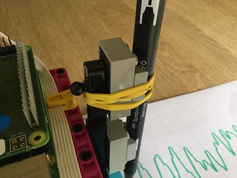
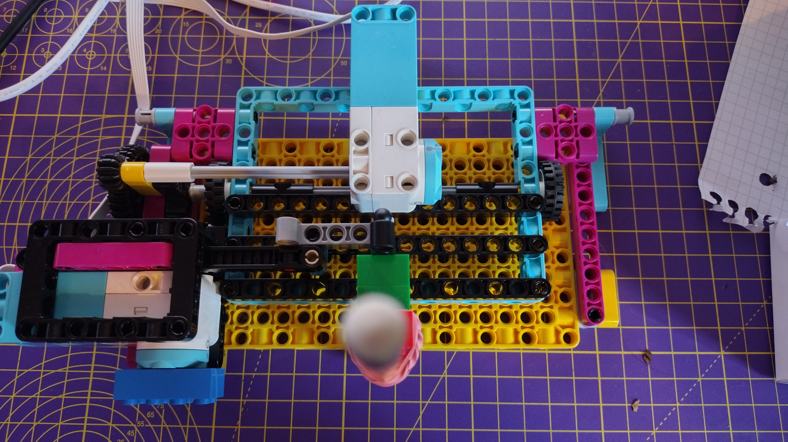

## Building the plotter

In this step you will build an x/y plotter using LEGO. 

There are plenty of ways you could do this, but the build instructions for the LEGO Spike Prime *Track Your Parcels* project are a great starting point. You can use the motor from the previous step for the y-axis motor (the one holding the pen) in the build. 


--- task ---
You will need to adapt the build slightly so that the arm is able to hold a pen. Rubber bands are a great way to hold a pen snugly against LEGO.



<embed src="https://le-www-live-s.legocdn.com/sc/media/lessons/prime/pdf/building-instructions/track-your-packages-bi-pdf-book1of2-05883f81fed73ac3738781d084e0d4e2.pdf" width="600" height="500" alt="pdf" pluginspage="http://www.adobe.com/products/acrobat/readstep2.html">
--- /task ---

The second part of the build completes the mechanism that uses the two motors to drive the plotter.


<embed src="https://le-www-live-s.legocdn.com/sc/media/lessons/prime/pdf/building-instructions/track-your-packages-bi-pdf-book2of2-80dc3c8c61ec2d2ffa785b688326ef74.pdf" width="600" height="500" alt="pdf" pluginspage="http://www.adobe.com/products/acrobat/readstep2.html">

--- task ---

Connect the LEGO Technic motor that drives the pen up and down to port A on the BuildHAT.

--- /task ---

Now you can use your simulated data source to test your plotter. For now, keep the lid on your pen or remove it all together while you observe the motion caused by the data.

### Calibrating the plotter

Your program currently allows the motor to move through its full range of motion (-180 to +180 degrees from the zero point). But the physical constraints of the plotter mean that if we tried to drive the toothed rail to its maximum and minimum positions, it would crash the pen arm into other parts of the build. In order to avoid this, we must centre the bar.

--- task ---

Click into the Shell pane of Thonny (the window beneath the code) so that we can execute Python one line at a time. 

Enter these lines into the shell (you can just copy-and-paste them from your program above) pressing Enter between each one:

```python
>>> from buildhat import Motor
```
Press Enter.

Type:
```python
>>> motor_y = Motor('A')
```
Press Enter.

Type:
```python
>>> motor_y.run_to_position(0, 100)
```
Press Enter.

This should centre or *zero* your motor.

--- /task ---

--- task ---
Adjust the position of your arm by gently pushing the toothed bar to the middle of its travel, so that the pencil or pen lines up with the other motor.



--- /task ---

--- save ---

