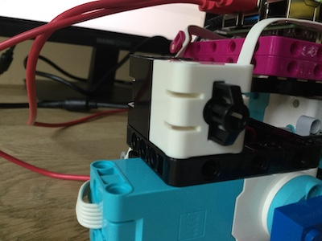

## Button control

To stop and start the plotter running, you can add a button to your build.

--- task ---

The LEGO® SPIKE™ Prime Force Sensor can act as a simple button. Connect one to port C on your Build HAT.

--- /task ---

--- task ---

Edit your `plotter.py` program to include a button control. Add a comma followed by `ForceSensor` (making sure you include **both** capital letters!) to the end of the line that says `from buildhat import Motor`:

--- code ---
---
language: python
filename: plotter.py
line_numbers: true
line_number_start: 1
line_highlights: 3
---

from random import randint
from time import sleep
from buildhat import Motor, ForceSensor

--- /code ---

--- /task ---

--- task ---

Add this line to create an object for the button after the similar lines for the motors:

--- code ---
---
language: python
filename: plotter.py
line_numbers: true
line_number_start: 5
line_highlights: 7
---

motor_y = Motor('A')
motor_x = Motor('B')
button = ForceSensor('C')
motor_y.run_to_position(0, 100)
motor_x.start(-25)

--- /code ---

--- /task ---

--- task ---

Change your main loop from `while True` to:

--- code ---
---
language: python
filename: plotter.py
line_numbers: true
line_number_start: 13
line_highlights: 
---

while not button.is_pressed():
    current_angle = motor_y.get_aposition()
    new_angle = randint(-180, 180)

--- /code ---

--- /task ---

--- task ---

Now you can stop the plotter operating by pressing the button. To tidy everything up and stop both motors, add the following lines at the end of your program.

--- code ---
---
language: python
filename: plotter.py
line_numbers: true
line_number_start: 19
line_highlights: 24-26
---

    elif new_angle < current_angle:
        motor_y.run_to_position(new_angle, 100, direction="anticlockwise")
        print('Turning ACW')
    sleep(0.1)
    
motor_x.stop()
motor_y.run_to_position(0, 100)

--- /code ---

--- /task ---

Now you are ready to test your plotter. Your final script should look like this:

--- code ---
---
language: python
filename: plotter.py
line_numbers: true
line_number_start: 1
---

#!/usr/bin/python3
from random import randint
from time import sleep
from buildhat import Motor, ForceSensor

button = ForceSensor('C')
motor_y = Motor('A')
motor_x = Motor('B')

motor_y.run_to_position(0, 100)
motor_x.start(speed=-25)

while not button.is_pressed():
    current_angle = motor_y.get_aposition()
    new_angle = randint(-180, 180)
    if new_angle > current_angle:
        motor_y.run_to_position(new_angle, 100, direction="clockwise")
        print('Turning CW')
    elif new_angle < current_angle:
        motor_y.run_to_position(new_angle, 100, direction="anticlockwise")
        print('Turning ACW')
    sleep(0.1)
    
motor_x.stop()
motor_y.run_to_position(0, 100)

--- /code ---

--- task ---

Feed a piece of paper from the back of the plotter so that the front short edge is just beyond the pen.

--- /task ---

--- task ---

Start the program in Thonny, and watch as the pen plots your random data on your paper!

--- /task ---

--- task ---

Once the paper has been used, press the Force Sensor button to stop everything. 

--- /task ---

In the next step, you will use a real-time data source for your input data! 

--- save ---
