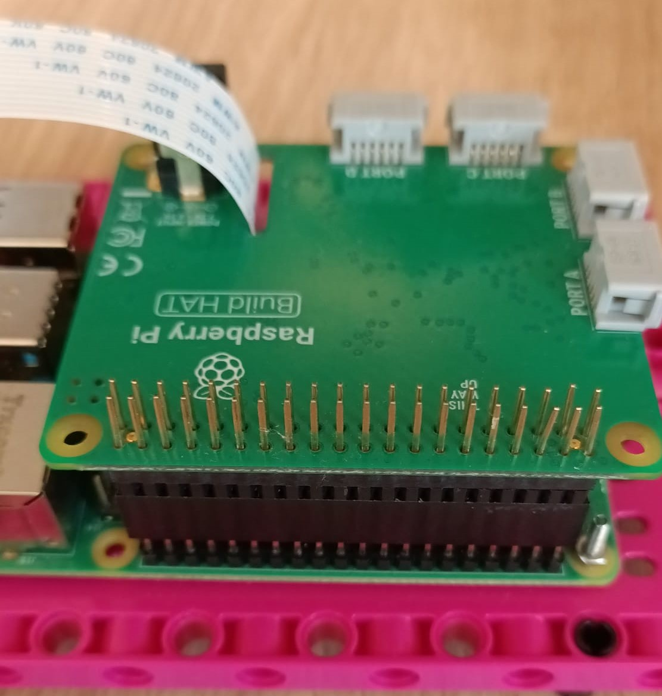

## Introduction

Use LEGO® and the Raspberry Pi Build HAT to create a data plotter.

### What you will make

--- no-print ---

--- /no-print ---

--- print-only ---  --- /print-only ---

### What you will learn

+ How to calculate angles of rotation
+ How to map data ranges onto appropriate scales for visualisation
+ How to use conditional statements (if/else)

### Hardware

+ A Raspberry Pi computer
+ A Raspberry Pi Build HAT
+ Two LEGO® Technic™ motors
+ A LEGO® SPIKE™ Force Sensor OR a push button, breadboard, and jumper wires
+ Assortment of LEGO®, including two small wheels (we used a selection from the [LEGO® Education SPIKE™ Prime kit](https://education.lego.com/en-gb/product/spike-prime))
+ A 7.5V power supply with a barrel jack (you could instead use a battery pack, but make sure that all cells are fully charged)

### Software

+ Python 3
+ The Vcgencmd Python3 library

### Downloads

+ [LEGO® SPIKE™ Prime building instructions: *Track Your Parcels* (1/2)](https://le-www-live-s.legocdn.com/sc/media/lessons/prime/pdf/building-instructions/track-your-packages-bi-pdf-book1of2-05883f81fed73ac3738781d084e0d4e2.pdf){:target="_blank"}
+ [LEGO® SPIKE™ Prime building instructions: *Track Your Parcels* (2/2)](https://le-www-live-s.legocdn.com/sc/media/lessons/prime/pdf/building-instructions/track-your-packages-bi-pdf-book2of2-80dc3c8c61ec2d2ffa785b688326ef74.pdf){:target="_blank"}
+ [Finished script for Lego Plotter](http://rpf.io/p/en/lego-plotter-go){:target="_blank"}

--- collapse ---
---
title: Install the Vcgencmd python library
---

Make sure you are connected to the internet.

Open the terminal on your Raspberry Pi by pressing <kbd>Ctrl</kbd>+<kbd>Alt</kbd>+<kbd>T</kbd> on your keyboard.

At the prompt type: `pip3 install vcgencmd` and press <kbd>Enter</kbd>.

Wait for the confirmation message (it won't take long) then close the terminal window.

--- /collapse ---

--- collapse ---
---
title: Additional information for educators
---

You can download the completed project [here](http://rpf.io/p/en/projectName-get){:target="_blank"}.

If you need to print this project, please use the [printer-friendly version](https://projects.raspberrypi.org/en/projects/projectName/print){:target="_blank"}.

--- /collapse ---

Before you begin, you'll need to have set up your Raspberry Pi computer and attached your Build HAT:

--- task ---

Mount your Raspberry Pi on to the LEGO Build Plate using M2 bolts and nuts, making sure the Raspberry Pi is on the side without the 'edge':

 

--- /task ---

Mounting the Raspberry Pi this way round enables easy access to the ports as well as the SD card slot. The Build Plate will allow you to connect the Raspberry Pi to the main structure of your dashboard more easily.

--- task ---

Line up the Build HAT with the Raspberry Pi, ensuring you can see the `This way up` label. Make sure all the GPIO pins are covered by the HAT, and press down firmly. (The example uses a [stacking header](https://www.adafruit.com/product/2223){:target="_blank"}, which makes the pins longer.)

 

--- /task ---

You should now power your Raspberry Pi using the 7.5V barrel jack on the Build HAT, which will allow you to use the motors.

--- task ---

If you have not already done so, set up your Raspberry Pi by following these instructions:

[Setting up your Raspberry Pi](https://projects.raspberrypi.org/en/projects/raspberry-pi-setting-up){:target="_blank"}

--- /task ---

--- task ---

Once the Raspberry Pi has booted, open the Raspberry Pi Configuration tool by clicking on the Raspberry Menu button and then selecting “Preferences” and then “Raspberry Pi Configuration”.

Click on the “interfaces” tab and adjust the Serial settings as shown below:

--- /task ---

--- task ---

You will also need to install the buildhat python library by following these instructions:

--- collapse ---
---
title: Install the buildhat Python library
---

Open a terminal window on your Raspberry Pi by pressing <kbd>Ctrl</kbd>+<kbd>Alt</kbd>+<kbd>T</kbd>.

At the prompt type: `sudo pip3 install buildhat`

Press <kbd>Enter</kbd> and wait for the "installation completed" message.

--- /collapse ---

--- /task ---
