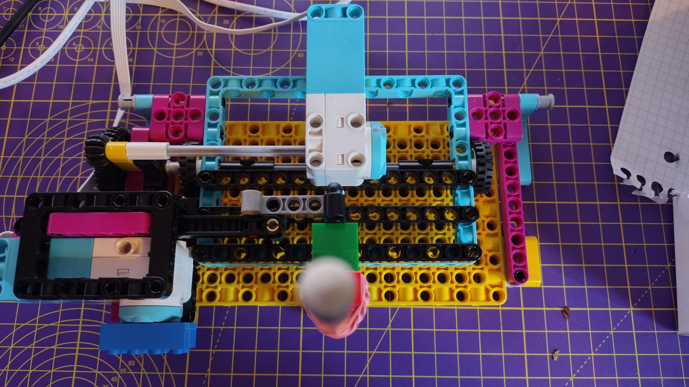

## Construye el trazador

En este paso, construirás un trazador x / y usando LEGO®.

Hay muchas formas de hacerlo, pero las instrucciones de construcción del proyecto LEGO® SPIKE ™ Prime *Sigue tus envíos* son un excelente punto de partida. Puedes usar el motor del paso anterior para el motor del eje y (el que sostiene el lápiz) en la construcción.


--- task ---

Deberás adaptar la estructura ligeramente para que el brazo pueda sostener un bolígrafo. Las bandas elásticas son una excelente manera de sujetar un bolígrafo cómodamente contra LEGO.


<embed src="https://le-www-live-s.legocdn.com/sc/media/lessons/prime/pdf/building-instructions/track-your-packages-bi-pdf-book1of2-05883f81fed73ac3738781d084e0d4e2.pdf" width="600" height="500" alt="pdf" pluginspage="http://www.adobe.com/products/acrobat/readstep2.html">

--- /task ---

La segunda parte de la construcción completa el mecanismo que usa los dos motores para impulsar el trazador.


<embed src="https://le-www-live-s.legocdn.com/sc/media/lessons/prime/pdf/building-instructions/track-your-packages-bi-pdf-book2of2-80dc3c8c61ec2d2ffa785b688326ef74.pdf" width="600" height="500" alt="pdf" pluginspage="http://www.adobe.com/products/acrobat/readstep2.html">

--- task ---

Conecta el motor LEGO® Technic ™ que mueve el lápiz hacia arriba y hacia abajo al puerto A del Build HAT.

--- /task ---

Ahora puedes usar tu fuente de datos simulada para probar tu trazador. Por ahora, mantén el bolígrafo tapado o quítalo del brazo del trazador mientras observas el movimiento causado por los datos.

### Calibrar el trazador

Tu programa actualmente permite que el motor se mueva a través de su rango completo de movimiento (-180 a +180 grados desde el punto cero). Pero las limitaciones físicas del trazador significan que si intentaras mover el riel dentado a sus posiciones máxima y mínima, el brazo de la pluma se estrellará contra otras partes de la construcción. Para evitar esto, debes centrar la barra.

--- task ---

Haz clic en el <strong x-id="1">panel de consola</strong> de Thonny (la ventana debajo del código) para poder ejecutar Python una línea a la vez.

Ingresa estas líneas en la <strong x-id="1">Consola</strong> (puedes copiarlas y pegarlas desde tu programa anterior) presionando <kbd>Entrar</kbd> entre cada una:

```python
>>> from buildhat import Motor
```
Presiona <kbd>Entrar</kbd>.

Escribe:
```python
>>> motor_y = Motor('A')
```
Presiona <kbd>Entrar</kbd>.

Escribe:
```python
>>> motor_y.run_to_position(0, 100)
```
Presiona <kbd>Entrar</kbd>.

Esto debería centrar o <strong x-id="1">poner a cero</strong> tu motor.

--- /task ---

--- task ---

Ajusta la posición del brazo del bolígrafo empujando suavemente la barra dentada hacia el centro de su recorrido, de modo que el lápiz o bolígrafo 



--- /task ---

--- save ---
