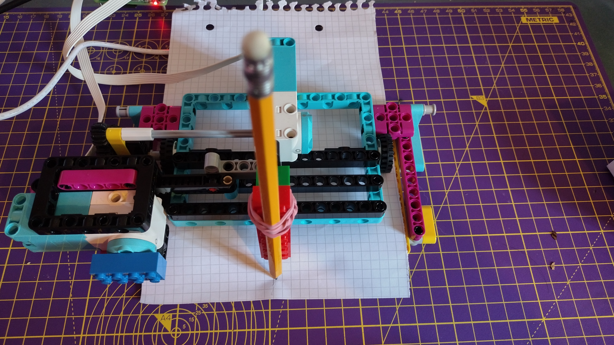

## Pon el papel

Ahora programarás el segundo motor para alimentar papel a través del trazador a una velocidad constante.

--- task ---

Carga una hoja de papel A5 (o corta algunos trozos de este tamaño) debajo de las pequeñas ruedas desde atrás.



--- /task ---

--- task ---

Enchufa el motor LEGO® Technic ™ trasero (que impulsa estas ruedas) en el puerto B del Build HAT.

--- /task ---

--- task ---

Crea un objeto llamado `motor_x` para este motor, debajo de la línea similar para `motor_y`:

--- code ---
---
language: python filename: plotter.py line_numbers: true line_number_start: 5
line_highlights: 6
---

motor_y = Motor('A') motor_x = Motor('B') motor_y.run_to_position(0, 100)

--- /code ---

--- /task ---

--- task ---

Agrega una línea para que este motor comience a girar inmediatamente antes del bucle `while True`:

--- code ---
---
language: python filename: plotter.py line_numbers: true line_number_start: 5
line_highlights: 8
---

motor_y = Motor('A') motor_x = Motor('B') motor_y.run_to_position(0, 100) motor_x.start(-25)

--- /code ---

--- /task ---

Esto hará que el motor del alimentador funcione a una velocidad constante de -25 vueltas por minuto cuando comience el programa. Cambia el número entre paréntesis para experimentar con la velocidad.

--- task ---

Ejecuta tu programa y observa cómo se alimenta el papel a través del trazador, mientras el lápiz se mueve aleatoriamente en la dirección `y`.


--- /task ---

Para detener el motor que alimenta el papel, puedes escribir lo siguiente en la **Consola**.

```python
>>> from buildhat import Motor
>>> motor_x = Motor('B')
>>> motor_x.stop()
```

--- save ---


