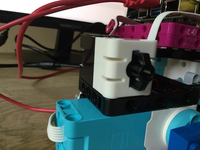
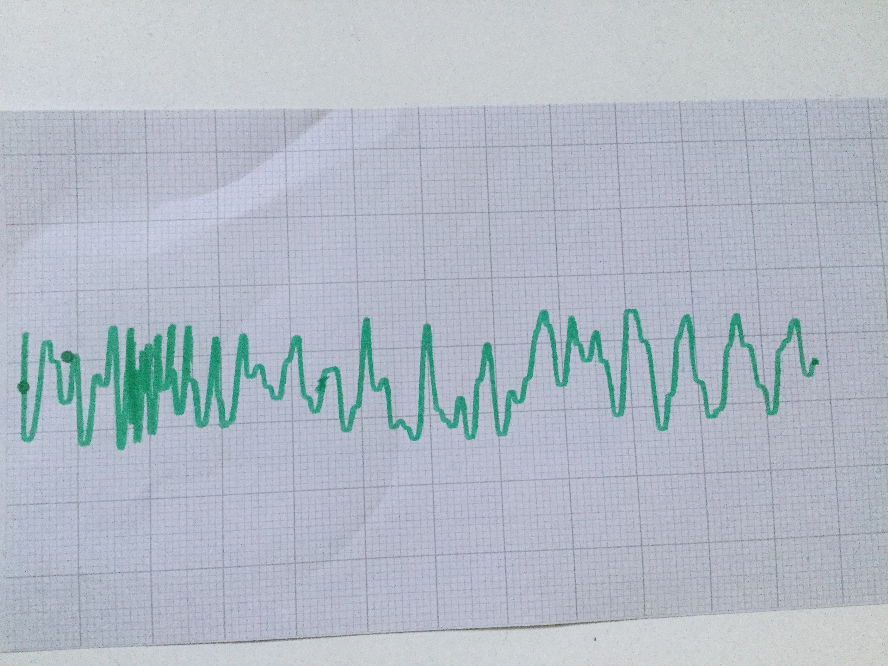

## Agrega un botón de control

Para detener e iniciar la ejecución del trazador, puedes agregar un botón a su construcción.

--- task ---

El sensor de fuerza principal LEGO® SPIKE ™ puede actuar como un simple botón. Conecta uno al puerto C en tu Build HAT.

--- /task ---

--- task ---

Edita tu programa `plotter.py` para incluir un botón de control. Agrega una coma seguida de `ForceSensor` (¡asegurándote de incluir **ambas** letras mayúsculas!) Al final de la línea que dice `from buildhat import Motor`:

--- code ---
---
language: python filename: plotter.py line_numbers: true line_number_start: 1
line_highlights: 3
---

from random import randint from time import sleep from buildhat import Motor, ForceSensor

--- /code ---

--- /task ---

--- task ---

Agrega esta línea para crear un objeto para el botón después de las líneas similares para los motores:

--- code ---
---
language: python filename: plotter.py line_numbers: true line_number_start: 5
line_highlights: 7
---

motor_y = Motor('A') motor_x = Motor('B') button = ForceSensor('C') motor_y.run_to_position(0, 100) motor_x.start(-25)

--- /code ---

--- /task ---

--- task ---

Cambie su bucle principal de `while True` a:

--- code ---
---
language: python filename: plotter.py line_numbers: true line_number_start: 13
line_highlights:
---

while not button.is_pressed(): current_angle = motor_y.get_aposition() new_angle = randint(-180, 180)

--- /code ---

--- /task ---

--- task ---

Ahora puedes detener el funcionamiento del plotter presionando el botón. Para finalizar todo y detener ambos motores, agrega las siguientes líneas al final de tu programa.

--- code ---
---
language: python filename: plotter.py line_numbers: true line_number_start: 19
line_highlights: 24-26
---

    elif nuevo_angulo < angulo_actual:
        motor_y.run_to_position(nuevo_angulo, 100, direction="anticlockwise")
        print('Girando en sentido antihorario')
    sleep(0.1)

motor_x.stop() motor_y.run_to_position(0, 100)

--- /code ---

--- /task ---

Ahora estás listo para probar tu trazador. Tu programa final debería verse así:

--- code ---
---
language: python filename: plotter.py line_numbers: true
line_number_start: 1
---

# !/usr/bin/python3
from random import randint from time import sleep from buildhat import Motor, ForceSensor

button = ForceSensor('C') motor_y = Motor('A') motor_x = Motor('B')

motor_y.run_to_position(0, 100) motor_x.start(speed=-25)

while not button.is_pressed(): current_angle = motor_y.get_aposition() new_angle = randint(-180, 180) if new_angle > current_angle: motor_y.run_to_position(new_angle, 100, direction="clockwise") print('Turning CW') elif new_angle < current_angle: motor_y.run_to_position(new_angle, 100, direction="anticlockwise") print('Turning ACW') sleep(0.1)

motor_x.stop() motor_y.run_to_position(0, 100)

--- /code ---

--- task ---

Alimenta un trozo de papel desde la parte posterior del trazador de modo que el borde corto delantero quede un poco más allá del lápiz.

--- /task ---

--- task ---

¡Inicia el programa en Thonny y observa cómo la pluma traza tus datos aleatorios en el papel!

--- /task ---

--- task ---

Una vez que se termine el papel, presiona el botón Force Sensor para detener todo.

--- /task ---

¡En el siguiente paso, utilizará una fuente de datos en tiempo real para tus datos de entrada!

--- save ---
