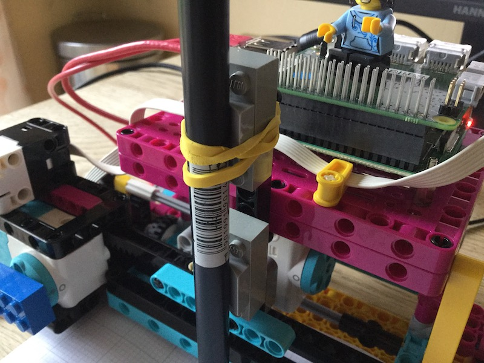

## はじめに

LEGO® と Raspberry Pi Build HATを使用して、データプロッターを作成します。

### 作るもの

--- no-print ---

--- /no-print ---

--- print-only ---  --- /print-only ---

### 学ぶこと

+ 回転角の計算方法
+ 視覚化のためにデータの範囲を適切な大きさにマッピングする方法
+ 条件文の使い方 (if/else)

### ハードウェア

+ Raspberry Pi 本体
+ Raspberry Pi Build HAT
+ 2つの LEGO® Technic™ モーター
+ LEGO® SPIKE™ フォースセンサーまたは押しボタン、ブレッドボード、ジャンパー線
+ 2つの小さなホイールを含む LEGO® 製品 (本項では [LEGO® エデュケーション SPIKE™ プライムセット](https://education.lego.com/en-gb/product/spike-prime) を使用することを前提とします)
+ バレルジャックの7.5V電源(電池ボックスを代わりに使用できますが、すべてのセルが完全に充電されていることを確認してください)

### ソフトウェア

+ Python 3
+ Vcgencmd Python3 ライブラリ

### ダウンロード

+ [LEGO® SPIKE™ Prime building instructions: *Track Your Parcels* (1/2)](https://le-www-live-s.legocdn.com/sc/media/lessons/prime/pdf/building-instructions/track-your-packages-bi-pdf-book1of2-05883f81fed73ac3738781d084e0d4e2.pdf){:target="_blank"}
+ [LEGO® SPIKE™ Prime building instructions: *Track Your Parcels* (2/2)](https://le-www-live-s.legocdn.com/sc/media/lessons/prime/pdf/building-instructions/track-your-packages-bi-pdf-book2of2-80dc3c8c61ec2d2ffa785b688326ef74.pdf){:target="_blank"}
+ [Lego プロッターの完成したスクリプト](http://rpf.io/p/ja-JP/lego-plotter-go){:target="_blank"}

--- collapse ---
---
title: Vcgencmd python ライブラリのインストール
---

インターネットに接続していることを確認してください。

キーボードの <kbd>Ctrl</kbd>+<kbd>Alt</kbd>+<kbd>T</kbd> を押して、Raspberry Pi上にターミナルウィンドウを開きます。

プロンプトで: `pip3 install vcgencmd` と入力し <kbd>Enter</kbd> キーを入力します。

確認のメッセージを待ってから(それほどかかりません)、ターミナルウィンドウを閉じます。

--- /collapse ---

--- collapse ---
---
title: 教育者向けの追加情報
---

完全なプロジェクトは [こちら](http://rpf.io/p/ja-JP/projectName-get){:target="_blank"} からダウンロードできます。

このプロジェクトを印刷する必要がある場合は[印刷用バージョン](https://projects.raspberrypi.org/ja-JP/projects/projectName/print){:target="_blank"}を使用してください。

--- /collapse ---

開始する前に、Raspberry Piのセットアップと、Build HATの装着をしてください:

--- task ---

M2のボルトとナットを使用して、 LEGO ビルドプレートの上にRaspberry Piを取り付けます。 Raspberry Piはふちがない方の面に載せます:

 

--- /task ---

写真のとおりにRaspberry Piを固定することで、SDカードスロットが扱いやすくなります。 ビルドプレートを使うことで、 ダッシュボードのおもな構造に、より簡単に Raspberry Pi を接続できます。

--- task ---

`This way up` の文字が見えるようにBuild HATをRaspberry Piと並べます。 全部のGPIOピンがHATにかぶるよう合わせて、しっかり押し下げてください。 (例ではピンが長くなる [スタッキングヘッダー](https://www.adafruit.com/product/2223){:target="_blank"}, を使用しています。)

 

--- /task ---

モーターを使用するためには、Build HAT上のバレルジャックに7.5Vの電源を接続してRaspberry Piに電源を供給する必要があります。

--- task ---

まだRaspberry Piのセットアップが済んでいない場合は、次の手順に従ってセットアップしてください:

[Setting up your Raspberry Pi](https://projects.raspberrypi.org/ja-JP/projects/raspberry-pi-setting-up){:target="_blank"}

--- /task ---

--- task ---

Raspberry Piが起動したら、Raspberry Piメニューをクリックして“Preferences”と “Raspberry Pi Configuration”の順に選択して、Raspberry Pi Configuration toolを起動します。

“interfaces”タブをクリックして、シリアルの設定を以下のとおりに設定します:

--- /task ---

--- task ---

また、以下の手順に従って、buildhat pythonのインストールも必要になります。

--- collapse ---
---
title: buildhat Python ライブラリーのインストール
---

<kbd>Ctrl</kbd>+<kbd>Alt</kbd>+<kbd>T</kbd> を押して、Raspberry Pi上にターミナルウィンドウを開きます。

プロンプトに次の通り入力します: `sudo pip3 install buildhat`

<kbd>Enter</kbd> キーを入力して "installation completed" のメッセージが表示されるまで待ちます。

--- /collapse ---

--- /task ---
