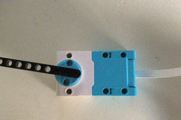

## データをもとにモーターを動かす

地震災害の映画で [地震計](https://ja.wikipedia.org/wiki/%E5%9C%B0%E9%9C%87%E8%A8%88) を使用して振動を表しているシーンを見たことがあるかもしれません。 

このようなデバイスの設計はとてもシンプルで、1つのモーターを使って紙がペンを通過するようにして(x軸)、もう1つのモーターを使ってデータの変化に応じてペンを最初のモーターと直角に動かしています(y軸)。 

このプロジェクトでは、 LEGO® でプロッターを作成し、それを Raspberry Pi に接続することでリアルタイムデータをプロットできるようにします。

--- task ---

モニター、キーボード、マウスをRaspberry Piに接続します。 これまでに Raspberry Pi を使用したことがない場合は、[このプロジェクト](https://projects.raspberrypi.org/en/projects/raspberry-pi-getting-started)から始めることをおすすめします。

Build HAT を Raspberry Pi に接続し(上部に Raspberry Pi のロゴが表示されていることを確認してください)、 7.5V 電源を Build HAT のバレルジャックに接続します。 すると、 Raspberry Pi が起動します。

--- /task ---

--- task ---

プログラミングメニューから Thonny を開き、次の行を追加して、使用するライブラリをインポートしてプログラムを開始します:

--- code ---
---
language: python filename: plotter.py line_numbers: true line_number_start: 1
line_highlights: 1,2,3
---

from random import randint from time import sleep from buildhat import Motor

--- /code ---

<kbd>Ctrl</kbd>+<kbd>s</kbd> を押してプログラムを `plotter.py` として保存します。

--- /task ---

--- task ---

次に、 `randint` 関数を使用して範囲 (今回は-180から180) を指定したランダムな値を作成し、それを `new_angle` という変数に格納します。

--- code ---
---
language: python filename: plotter.py line_numbers: true line_number_start: 5
line_highlights: 5,6
---

new_angle = randint(-180,180) print(new_angle)

--- /code ---

--- /task ---

--- task ---

ウィンドウの上部にある **Run** ボタンをクリックしてプログラムを何度か実行します。 常に異なる値がコードの下のシェルに表示されるはずです。

--- /task ---

このスクリプトを手で実行するかわりに、 **ループ** を作成してスクリプトを繰り返し実行しましょう。 同じ行を繰り返し実行するには、 `while True:` ループを使用します。

--- task ---

<kbd>Enter</kbd> を押して、追加したコードの上に空白行を追加します。

この新しい行に `While True:` を入力します。大文字の 'T' があることを確認してください。

--- code ---
---
language: python filename: plotter.py line_numbers: true line_number_start: 5
line_highlights: 5
---

while True: new_angle = randint(-180,180) print(new_angle)

--- /code ---

--- /task ---

--- task ---

下の各行の先頭にスペースを4つ追加して、**インデントされたコードブロック**を作成します。 これは、どの行がループに含まれるかをコンピューターに知らせます。

--- code ---
---
language: python filename: plotter.py line_numbers: true line_number_start: 5
line_highlights: 6,7
---

while True: new_angle = randint(-180,180) print(new_angle)

--- /code ---

--- /task ---

--- task ---

コードの最後で <kbd>Enter</kbd> を押して、別のインデントされた行を追加します。 この行に `sleep(0.1)` と入力します。

--- code ---
---
language: python filename: plotter.py line_numbers: true line_number_start: 5
line_highlights: 8
---

while True: new_angle = randint(-180,180) print(new_angle) sleep(0.1)

--- /code ---

--- /task ---

--- task ---

コードを実行して、シェルに出力された値を確認します。 なにかエラーが発生した場合は、コードが次のようになっていることを確認してください:

--- code ---
---
language: python filename: plotter.py line_numbers: true
line_number_start: 1
---

from random import randint from time import sleep from buildhat import Motor

while True: new_angle = randint(-180,180) print(new_angle) sleep(0.1)

--- /code ---

--- /task ---

いくつかのデータが得られたので、これを使用してモーターの位置を制御できます。

--- task ---

LEGO® Technic™ モーターを Build HAT のポート A に接続します。 モーターの回転が簡単に確認できるように、モーターの軸に LEGO の要素をいくつか追加します。

--- /task ---

--- task ---

要素をモーターのラインマークに合わせてから、モーターをゼロ位置に設定します:

--- /task ---

次に、モーターによって回転した角度が、シミュレートされたセンサーによって生成された最新の値と同じになるように、プログラム本体を変更します。

これを行うには、プログラムからアクセスできるようにモーターを設定する必要があります。

--- task ---

`motor_y` オブジェクトを Build HAT のポート `A` 向けに作成して、モーターを `0` の位置に `100`のスピードで回転させます。

--- code ---
---
language: python filename: plotter.py line_numbers: true line_number_start: 4
line_highlights: 5, 6
---

motor_y = Motor('A') motor_y.run_to_position(0, 100)

--- /code ---

--- /task ---

--- task ---

次の行では、モーターを `new_angle` に格納された角度に回転させます。

--- code ---
---
language: python filename: plotter.py line_numbers: true line_number_start: 7
line_highlights: 11
---

while True: new_angle = randint(-180,180) print(new_angle) motor_y.run_to_position(new_angle, 100)

--- /code ---

--- /task ---

--- task ---

**Run** をクリックすると、変化するデータに応じてモーターが時計回りからさまざまな位置に回転するのが見られます。 プログラムを再度実行すると、ランダムに移動する前に、モーターの位置が `0` にリセットされます。

エラーが発生した場合は、コードが次のようになっていることを確認してください。

--- code ---
---
language: python filename: plotter.py line_numbers: true
line_number_start: 1
---

from random import randint from time import sleep from buildhat import Motor

motor_y = Motor('A') motor_y.run_to_position(0, 100)

while True: new_angle = randint(-180,180) print(new_angle) motor_y.run_to_position(new_angle, 100) sleep(0.1)

--- /code ---

--- /task ---

--- save ---
