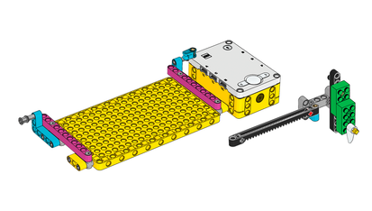

## プロッターを組み立てる

このステップでは、 LEGO® を使用して x/y プロッターを作成します。

作成方法はたくさんありますが、 LEGO® SPIKE™ Prime *Track Your Percels* プロジェクトの組み立て手順が良い取っ掛かりになります。 なお、前のステップで使ったモーターはY軸のモーター (ペンを押さえる側) の組み立てに使用できます。



--- task ---

アームがペンを押さえられるように、組み立て方を少し工夫する必要があります。 輪ゴムを使ってペンをレゴにしっかり固定すると良いでしょう。


<embed src="https://le-www-live-s.legocdn.com/sc/media/lessons/prime/pdf/building-instructions/track-your-packages-bi-pdf-book1of2-05883f81fed73ac3738781d084e0d4e2.pdf" width="600" height="500" alt="pdf" pluginspage="http://www.adobe.com/products/acrobat/readstep2.html">

--- /task ---

組み立ての2番目の部分は、2つのモーターを使用してプロッターを動かすメカニズムを完成させます。


<embed src="https://le-www-live-s.legocdn.com/sc/media/lessons/prime/pdf/building-instructions/track-your-packages-bi-pdf-book2of2-80dc3c8c61ec2d2ffa785b688326ef74.pdf" width="600" height="500" alt="pdf" pluginspage="http://www.adobe.com/products/acrobat/readstep2.html">

--- task ---

ペンを上下に動かすための LEGO® Technic™ モーターを Build HAT のポート A に接続します。
    
--- /task ---

これで、シミュレートされた情報源を使用してプロッターのテストができます。 データによっておこる動きを観察している間は、ひとまずはペンにふたをしておくか、ペン自体を取り外しておきます。

### プロッターの調整

プログラムはいまのところ、モーターが可動域 (ゼロを起点に -180度 から +180 度まで) 全体に移動できるようになっています。 ただし、プロッターの物理的な制約によって、歯型のレールを最大位置や最小位置に動かそうとすると、ペンのアームが組み立てた他の部分にぶつかってしまいます。 これを回避するには、バーを中央に配置する必要があります。

--- task ---

Thonnyの**シェルペイン** (コードの下のウィンドウ) をクリックして、Pythonを1行ずつ実行できるようにします。

これらの行を **シェル** に入力して (上のプログラムからただコピーして貼り付けられます) 、各行を入力するごとに <kbd>Enter</kbd> を押します。

```python
>>> from buildhat import Motor
```
<kbd>Enter</kbd> を押します。

続けて入力します:
```python
>>> motor_y = Motor('A')
```
<kbd>Enter</kbd> を押します。

続けて入力します:
```python
>>> motor_y.run_to_position(0, 100)
```
<kbd>Enter</kbd> を押します。

これで、中央の位置がモーターの**ゼロ**になります。

--- /task ---

--- task ---

鉛筆もしくはペンが、他のモーターと揃うように、歯型のバーをパスの中央にやさしく押して、ペンのアームの位置を調整します。


--- /task ---

--- save ---

