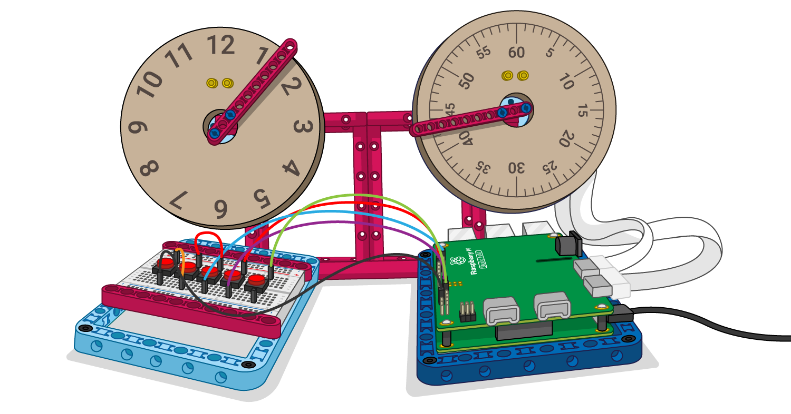

## 次は何をしますか？

+ LEGO® Technic™ カラーセンサーを追加して、用紙がなくなったことを検出してみましょう。

+ LEGO® Technic™ フォースセンサーのコードを変更して、センサーを押す量の増加に応じて、紙の送り出しを制御するモーターの速度が上がるようにしてみましょう。

+ 他のデータソースを追加してみましょう。 別の外部センサーや、オンラインのデータストリームをフィードに使用できます。

[LEGO BuildHATの紹介](https://projects.raspberrypi.org/ja-JP/pathways/lego-intro)のパスに沿って進めている場合は、[LEGO データダッシュ](https://projects.raspberrypi.org/ja-JP/projects/lego-data-dash)のプロジェクトに進むことができます。 このプロジェクトでは、 LEGO を使用していくつかのダイヤルと読み取りを作成して、世界中のあらゆる場所の大気質データを表示できるようにそれらを取得します。

Pythonのさまざまな機能を触ってみたい場合は、[これらのプロジェクト](https://projects.raspberrypi.org/ja-JP/projects?software%5B%5D=python)を試してみてください。

***

このプロジェクトは以下のボランティアによって翻訳されました。

Akira Ouchi

ボランティアのおかげで、世界中の人々に母国語で学ぶ機会を与えることができます。翻訳を引き受けていただくことで、より多くの人々に手を差し伸べることができます。詳しくは [rpf.io/translate](https://rpf.io/translate) をご覧ください。