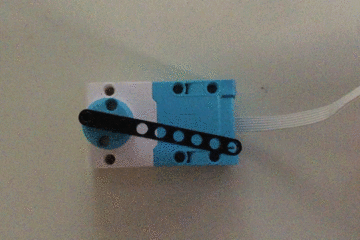

## 플롯 범위 생성하기

이 단계에서는 모터가 움직이는 방향(시계 방향 또는 시계 반대 방향)을 제어하여 각 방향의 최대 이동 지점을 설정해 볼 것입니다.

--- collapse ---
---
title: 모터가 움직이는 방식을 바꿔야 하는 이유
---

모터는 항상 새 위치로 가는 최단 경로를 따르기 때문입니다.

예를 들어 모터가 170도이고 다음 위치가 -170도인 경우 가능한 한 빨리 목적지에 도달하기 위해 180도 위치를 통과하여 시계 방향으로 이동하게 됩니다.

이것은 시뮬레이션에 적합하지만 플로터에는 이러한 이동이 불가능합니다. 펜이 종이의 위쪽이나 아래쪽(y축)에 도달하면 아래쪽으로 나올 때까지 계속 이동할 수 없으며 결국 부러집니다. 따라서 플로터가 180도 표시를 지나 시계 방향으로 이동하지 않도록 해야 합니다.

이 문제는 위치로 이동할 때 모터의 동작을 변경하여 해결할 수 있습니다. `direction=` 매개변수를 `run_to_position()` 함수에 전달하여 이를 수행할 수 있습니다. 이 값은 기본 '최단 경로' 동작인 `"clockwise"`, `"anticlockwise"`또는 `"shortest"` 로 설정할 수 있습니다.

따라서, `motor_y.run_to_position(50, 100, direction="anticlockwise")` 코드는 모터를 50도 위치로 구동하여 최대 속도로 시계 반대 방향으로 회전하게 해 줍니다.

**조건부 확인** 을 루프에 추가하여 모터가 180도를 통과하지 않고 시계 반대 방향으로 회전하여 항상 더 높은 각도에서 더 낮은 각도로 이동하도록 할 수 있습니다.

`motor_y.get_aposition`을 사용하여, 모터의 마지막 포지션을 찾을 수 있습니다.

--- /collapse ---

--- task ---

`while` 루프 상단에서 모터의 현재 각도를 확인하세요.

--- code ---
---
language: python filename: plotter.py line_numbers: true line_number_start: 7
line_highlights: 8
---

while True: current_angle = motor_y.get_aposition() new_angle = randint(-180, 180) print(new_angle) motor_y.run_to_position(new_angle, 100) sleep(0.1)

--- /code ---

--- /task ---

--- task ---

이제 `while` 루프에서는 `new_angle` 이 `current_angle`보다 크거나 작은지 확인하는 검사를 수행할 수 있습니다.

--- code ---
---
language: python filename: plotter.py line_numbers: true line_number_start: 7
line_highlights: 11-16
---

while True: current_angle = motor_y.get_aposition() new_angle = randint(-180, 180) print(new_angle) if new_angle > current_angle: motor_y.run_to_position(new_angle, 100, direction="clockwise") print('Turning CW') elif new_angle < current_angle: motor_y.run_to_position(new_angle, 100, direction="anticlockwise") print('Turning ACW') sleep(0.1)

--- /code ---

--- /task ---

--- task ---

코드를 테스트해 보세요. These conditional tests will prevent the motor from changing from a negative value to a positive one by passing through 180 degrees (and vice versa).

--- /task ---

--- save ---

