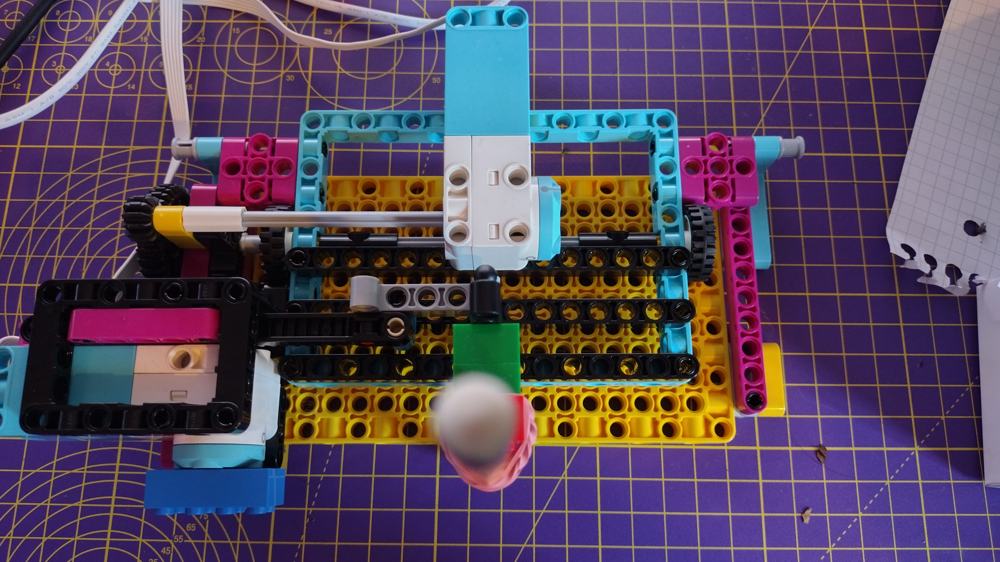

## 플로터 제작하기

이 단계에서는 LEGO®를 사용하여 x/y 플로터를 구축할 것입니다.

이 작업을 수행할 수 있는 방법은 많이 있지만 LEGO® SPIKE™ Prime *Track Your Parcels* 프로젝트의 조립 설명서가 훌륭한 참고자료가 됩니다. 빌드에서 y축 모터(펜을 잡고 있는 모터)에 대해, 이전 단계의 모터를 사용할 수 있습니다.


--- task ---

팔이 펜을 잡을 수 있도록 빌드를 약간 조정하여야 합니다. 고무줄은 펜을 LEGO에 꼭 맞도록 고정하는 좋은 방법입니다.


<embed src="https://le-www-live-s.legocdn.com/sc/media/lessons/prime/pdf/building-instructions/track-your-packages-bi-pdf-book1of2-05883f81fed73ac3738781d084e0d4e2.pdf" width="600" height="500" alt="pdf" pluginspage="http://www.adobe.com/products/acrobat/readstep2.html">

--- /task ---
  
빌드의 두 번째 부분에서는, 두 개의 모터를 사용하여 플로터를 구동하는 메커니즘을 완성합니다.
  
  
  
<embed src="https://le-www-live-s.legocdn.com/sc/media/lessons/prime/pdf/building-instructions/track-your-packages-bi-pdf-book2of2-80dc3c8c61ec2d2ffa785b688326ef74.pdf" width="600" height="500" alt="pdf" pluginspage="http://www.adobe.com/products/acrobat/readstep2.html">
       
--- task ---
      
펜을 위아래로 움직이는 LEGO® Technic™ 모터를, Build HAT의 포트 A에 연결하세요.
      
--- /task ---
      
이제 시뮬레이션된 데이터 소스를 활용하여, 플로터를 테스트할 수 있습니다. 지금은 데이터로 인한 움직임을 관찰하는 test 작업이니, 펜의 뚜껑을 덮은 상태로 두거나, 펜 자체를 제거하세요.
      
### 플로터 보정

현재 프로그램은 모터가 전체 동작 범위(영점에서 -180 ~ +180도)를 통해 이동할 수 있도록 허용하고 있습니다. 그러나 플로터의 한계로 인해 톱니형 레일을 최대 및 최소 위치로 구동하려고 하면 펜 암이 빌드의 다른 부분에 충돌하게 되는 문제가 있습니다. 이를 방지하려면 막대를 중앙에 배치하여야 합니다.

--- task ---

Python을 한 번에 한 줄씩 실행할 수 있도록 Thonny의 <strong x-id="1">Shell pane</strong> 을 켜 보세요.

아래의 라인들을 <strong x-id="1">Shell</strong> 에 입력합니다(위의 프로그램에서 복사하여 붙여넣을 수 있음). 입력 후,  <kbd>Enter</kbd> 키를 누르세요.

```python
>>> from buildhat import Motor
```
<kbd>Enter</kbd> 를 누릅니다.

유형:
```python
>>> motor_y = Motor('A')
```
<kbd>Enter</kbd> 를 누릅니다.

유형:
```python
>>> motor_y.run_to_position(0, 100)
```
<kbd>Enter</kbd> 를 누릅니다.

이것은 모터를 중심 또는 <strong x-id="1">0</strong>도로 만듭니다.

--- /task ---

--- task ---

연필이나 펜이 다른 모터와 일직선이 되도록 톱니 막대를 경로 중앙으로 부드럽게 밀어 펜 암의 위치를 조정해 보세요.



--- /task ---

--- save ---


