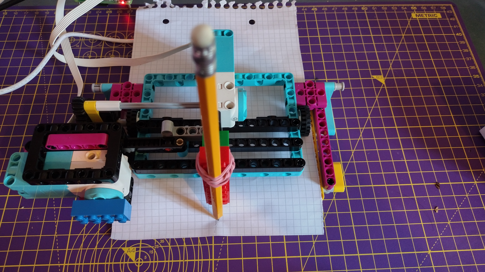

## 용지 급지

이제 플로터를 통해 일정한 속도로 용지를 공급하도록 두 번째 모터를 프로그래밍해 보겠습니다.

--- task ---

뒤에서 작은 바퀴 아래에 A5 용지 한 장을 급지합니다(또는 이 크기로 일부 스크랩을 자릅니다).



--- /task ---

--- task ---

후면 LEGO® Technic™ 모터(이 휠을 구동함)를 Build HAT의 포트 B에 꽂습니다.

--- /task ---

--- task ---

`motor_y`대한 유사한 라인 아래에 `motor_x` 이라는 객체를 생성하세요.

--- code ---
---
language: python filename: plotter.py line_numbers: true line_number_start: 5
line_highlights: 6
---

motor_y = Motor('A') motor_x = Motor('B') motor_y.run_to_position(0, 100)

--- /code ---

--- /task ---

--- task ---

`while True` 루프 직전에 이 모터 회전을 시작하는 라인을 추가합니다:

--- code ---
---
language: python filename: plotter.py line_numbers: true line_number_start: 5
line_highlights: 8
---

motor_y = Motor('A') motor_x = Motor('B') motor_y.run_to_position(0, 100) motor_x.start(-25)

--- /code ---

--- /task ---

이렇게 하면 프로그램이 시작될 때 피더 모터가 분당 -25회전의 일정한 속도로 실행되도록 합니다. 속도를 실험하기 위해 괄호 안의 숫자를 변경하세요.

--- task ---

`y` 방향으로 무작위로 움직일 때 코드를 실행하고 플로터를 통해 용지가 공급되는 것을 지켜보세요.


--- /task ---

용지를 공급하는 모터를 중지하려면 **Shell** 에 아래 코드를 입력할 수 있습니다:

```python
>>> from buildhat import Motor
>>> motor_x = Motor('B')
>>> motor_x.stop()
```

--- save ---


