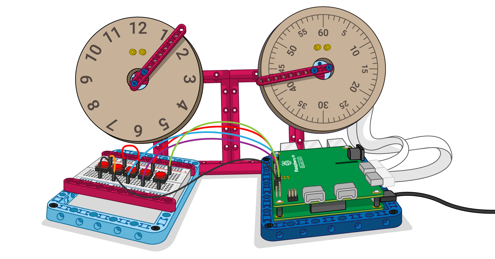

## 더 나아가기

+ LEGO® Technic™ 컬러 센서를 추가하여 용지가 떨어졌을 때 용지 없음을 감지해 보기

+ LEGO® Technic™ Force Sensor 코드를 수정하여 센서에 가해지는 압력을 높여, 용지 공급을 제어하는 모터의 속도를 높이기

+ 다른 데이터 소스를 추가하기. 다른 외부 센서나, 온라인 데이터 스트림에 대한 피드를 사용할 수 있습니다.

[LEGO Build HAT](https://projects.raspberrypi.org/ko-KR/pathways/lego-intro) 프로젝트를 따르는 경우 [LEGO 데이터 대시보드](https://projects.raspberrypi.org/ko-KR/projects/lego-data-dash) 프로젝트로 이동할 수 있습니다. 이 프로젝트에서는 LEGO로 다이얼과 판독값을 만들어, 전 세계 어디에서나 해당 지역의 공기질 데이터를 표시하도록 합니다!

더 재미있게 파이썬을 탐색하고 싶다면 [이 프로젝트](https://projects.raspberrypi.org/ko-KR/projects?software%5B%5D=python) 중 하나를 시도해 볼 수 있습니다.

***
이 프로젝트는 아래 자원 봉사자들에 의해 번역되었습니다:

강태원

번역 봉사자들 덕분에 우리는 전 세계 사람들에게 프로그래밍을 모국어로 배울 수 있는 기회를 제공하고 있습니다. 번역 봉사에 동참해서 더 많은 사람들에게 프로그래밍을 배울 수 있는 기회를 제공하세요 - [rpf.io/translate](https://rpf.io/translate)에서 더 많은 정보를 확인하세요.
