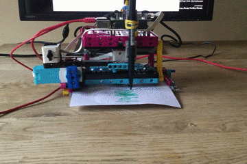

## Введение

Используй LEGO® и Raspberry Pi Build HAT, чтобы создать плоттер данных.

### Что ты сделаешь

--- no-print ---

--- /no-print ---

--- print-only ---  --- /print-only ---

### Чему ты научишься

+ Как рассчитать углы поворота
+ Как сопоставить диапазоны данных с соответствующими масштабами для визуализации
+ Как использовать условные операторы (if/else)

### Оборудование

+ Компьютер Raspberry Pi
+ Плата Raspberry Pi Build HAT
+ Два двигателя LEGO® Technic™
+ Датчик силы LEGO® SPIKE™ ИЛИ кнопка; макетная плата и провода-перемычки
+ Детали LEGO®, включая 2 малых колеса (мы использовали детали из [набора LEGO® Education SPIKE™ Prime](https://education.lego.com/en-gb/product/spike-prime))
+ Блок питания 7,5 В с циллиндрическим разъемом (вместо него можно использовать батарейный блок, но убедись, что все элементы полностью заряжены)

### Программное обеспечение

+ Python 3
+ Библиотека Python3 Vcgencmd

### Загрузки

+ [Инструкции по сборке LEGO® SPIKE™ Prime: *Отследи свои посылки* (1/2)](https://le-www-live-s.legocdn.com/sc/media/lessons/prime/pdf/building-instructions/track-your-packages-bi-pdf-book1of2-05883f81fed73ac3738781d084e0d4e2.pdf){:target="_blank"}
+ [Инструкции по сборке LEGO® SPIKE™ Prime: *Отследи свои посылки* (2/2)](https://le-www-live-s.legocdn.com/sc/media/lessons/prime/pdf/building-instructions/track-your-packages-bi-pdf-book2of2-80dc3c8c61ec2d2ffa785b688326ef74.pdf){:target="_blank"}
+ [Готовый скрипт для Плоттера Lego](http://rpf.io/p/en/lego-plotter-go){:target="_blank"}

--- collapse ---
---
title: Установка библиотеки Python Vcgencmd
---

Убедись, что ты подключён к Интернету.

Открой окно терминала на Raspberry Pi, нажав <kbd>Ctrl</kbd>+<kbd>Alt</kbd>+<kbd>T</kbd> на своей клавиатуре.

В командной строке введи: `pip3 install vcgencmd` и нажми <kbd>Ввод</kbd>.

Дождись подтверждающего сообщения (это не займет много времени), затем закрой окно терминала.

--- /collapse ---

--- collapse ---
---
title: Дополнительная информация для преподавателей
---

Ты можешь скачать завершенный проект [здесь](http://rpf.io/p/en/projectName-get){:target="_blank"}.

Если ты хочешь распечатать этот проект, то воспользуйся [версией для печати](https://projects.raspberrypi.org/en/projects/projectName/print){:target="_blank"}.

--- /collapse ---

Прежде чем ты начнешь, тебе необходимо настроить твой компьютер Raspberry Pi и подключить свою плату Build HAT:

--- task ---

Установи Raspberry Pi на Cтроительную Пластину LEGO с помощью болтов и гаек M2, убедившись, что Raspberry Pi лежит на стороне пластины без «борта»:

 

--- /task ---

Установка Raspberry Pi таким образом обеспечивает легкий доступ к портам, а также к слоту для SD-карты. Строительная Платформа позволит тебе более легко подключить Raspberry Pi к основной структуре твоей панели инструментов.

--- task ---

Совмести плату Build HAT с Raspberry Pi, убедившись, что ты видишь надпись на английском `This way up`. Убедись, что все контакты GPIO закрыты платой HAT, и с усилием надави на плату. (В примере используется [проводные клеммы](https://www.adafruit.com/product/2223){:target="_blank"}, которые делают выводы длиннее)

 

--- /task ---

Теперь ты должен подать питание на Raspberry Pi с помощью цилиндрического разъема 7,5 В на плате Build HAT, что позволит тебе использовать двигатели.

--- task ---

Если ты еще этого не сделал, настрой Raspberry Pi, следуя этим инструкциям:

[Настройка твоей Raspberry Pi](https://projects.raspberrypi.org/en/projects/raspberry-pi-setting-up){:target="_blank"}

--- /task ---

--- task ---

После загрузки Raspberry Pi открой Инструмент Настройки Raspberry Pi, нажав кнопку Меню Raspberry и выбрав «Настройки», а затем «Конфигурация Raspberry Pi».

Выбери вкладку «Интерфейсы» и настрой параметры последовательного порта, как показано ниже:

--- /task ---

--- task ---

Тебе также понадобится установить библиотеку Python buildhat, следуя этим инструкциям:

--- collapse ---
---
title: Установка библиотеки Python buildhat
---

Открой окно терминала на Raspberry Pi, нажав <kbd>Ctrl</kbd>+<kbd>Alt</kbd>+<kbd>T</kbd> на своей клавиатуре.

В командной строке введи: `sudo pip3 install buildhat`

Нажми <kbd>Ввод</kbd> и дождись сообщения «установка завершена» (или «installation completed» на английском).

--- /collapse ---

--- /task ---
