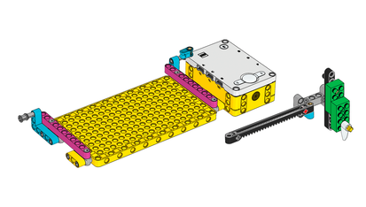
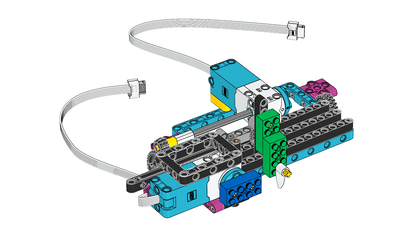

## Строим плоттер

На этом этапе ты построишь координатно-указательный плоттер с помощью LEGO®.

Есть много способов сделать это, но инструкции по сборке для проекта LEGO® SPIKE™ Prime *Отследи свои посылки* — отличная отправная точка. Ты можешь использовать двигатель из предыдущего шага для двигателя оси Y (тот, который держит перо) в этой сборке.



--- task ---

Тебе нужно будет немного адаптировать конструкцию, чтобы рука могла держать ручку. Резиновые ленты — отличный способ плотно прижать ручку к LEGO.


<embed src="https://le-www-live-s.legocdn.com/sc/media/lessons/prime/pdf/building-instructions/track-your-packages-bi-pdf-book1of2-05883f81fed73ac3738781d084e0d4e2.pdf" width="600" height="500" alt="pdf" pluginspage="http://www.adobe.com/products/acrobat/readstep2.html">

--- /task ---

Вторая часть сборки завершает механизм, который использует два двигателя для привода плоттера.



<embed src="https://le-www-live-s.legocdn.com/sc/media/lessons/prime/pdf/building-instructions/track-your-packages-bi-pdf-book2of2-80dc3c8c61ec2d2ffa785b688326ef74.pdf" width="600" height="500" alt="pdf" pluginspage="http://www.adobe.com/products/acrobat/readstep2.html">

--- task ---
      
Подсоедини двигатель LEGO® Technic™, который двигает ручку вверх и вниз, к порту A на Build HAT.
      
--- /task ---
      
Теперь ты можешь использовать смоделированный источник данных для тестирования плоттера. А пока держи крышку на своей ручке или сними ее целиком, наблюдая за движением, вызванным данными.
      
### Калибровка плоттера

В настоящее время твоя программа позволяет двигателю совершать полный диапазон движения (от -180 до +180 градусов от нулевой точки). Но физические ограничения плоттера подразумевают, что если ты попытаешься установить зубчатую рейку в ее максимальное и минимальное положения, она врежет ручку пера в другие части сборки. Для того, чтобы этого избежать, необходимо центрировать планку.

--- task ---

Нажми на панель **Оболочка** Thonny (окно под кодом), чтобы ты мог выполнять код Python по одной строке за раз.

Введи эти строки в оболочку **Оболочке** (ты можешь просто скопировать и вставить их из своей программы выше), нажав <kbd>Ввод</kbd> между каждой из них:

```python
>>> from buildhat import Motor
```
Нажми <kbd>Ввод</kbd>.

Введи:
```python
>>> motor_y = Motor('A')
```
Нажми <kbd>Ввод</kbd>.

Введи:
```python
>>> motor_y.run_to_position(0, 100)
```
Нажми <kbd>Ввод</kbd>.

Это должно центрировать или <strong x-id="1">обнулить** твой двигатель.

--- /task ---

--- task ---

Отрегулируй положение рычага пера, осторожно надавив на зубчатый стержень до середины его пути, чтобы карандаш или ручка выровнялись с другим мотором.


--- /task ---

--- save ---

