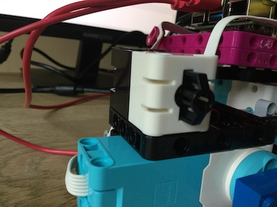

## Добавляем элемент управления «кнопка»

Чтобы остановить и запустить плоттер, ты можешь добавить кнопку в свою сборку.

--- task ---

Датчик силы LEGO® SPIKE™ Prime может работать как простая кнопка. Подключи её к порту C на твоей плате Build HAT.

--- /task ---

--- task ---

Отредактируй программу `plotter.py`, включив в неё кнопку управления. Добавь запятую, а затем `ForceSensor` (убедись, что ты использовал **обе** заглавные буквы!) в конец строки, которая говорит `from buildhat import Motor`:

--- code ---
---
language: python filename: plotter.py line_numbers: true line_number_start: 1
line_highlights: 3
---

from random import randint from time import sleep from buildhat import Motor, ForceSensor

--- /code ---

--- /task ---

--- task ---

Добавь эту строку, чтобы создать объект для кнопки после аналогичных строк для моторов:

--- code ---
---
language: python filename: plotter.py line_numbers: true line_number_start: 5
line_highlights: 7
---

motor_y = Motor('A') motor_x = Motor('B') button = ForceSensor('C') motor_y.run_to_position(0, 100) motor_x.start(-25)

--- /code ---

--- /task ---

--- task ---

Измени свой основной цикл с `while True` на:

--- code ---
---
language: python filename: plotter.py line_numbers: true line_number_start: 13
line_highlights:
---

while not button.is_pressed(): current_angle = motor_y.get_aposition() new_angle = randint(-180, 180)

--- /code ---

--- /task ---

--- task ---

Теперь ты можешь остановить работу плоттера, нажав кнопку. Чтобы все привести в порядок и остановить оба двигателя, добавь следующие строки в конец твоей программы.

--- code ---
---
language: python filename: plotter.py line_numbers: true line_number_start: 19
line_highlights: 24-26
---

    elif new_angle < current_angle:
        motor_y.run_to_position(new_angle, 100, direction="anticlockwise")
        print('Turning ACW')
    sleep(0.1)

motor_x.stop() motor_y.run_to_position(0, 100)

--- /code ---

--- /task ---

Теперь ты готов протестировать свой плоттер. Твой финальный скрипт должен выглядеть вот так:

--- code ---
---
language: python filename: plotter.py line_numbers: true
line_number_start: 1
---

# !/usr/bin/python3
from random import randint from time import sleep from buildhat import Motor, ForceSensor

button = ForceSensor('C') motor_y = Motor('A') motor_x = Motor('B')

motor_y.run_to_position(0, 100) motor_x.start(speed=-25)

while not button.is_pressed(): current_angle = motor_y.get_aposition() new_angle = randint(-180, 180) if new_angle > current_angle: motor_y.run_to_position(new_angle, 100, direction="clockwise") print('Turning CW') elif new_angle < current_angle: motor_y.run_to_position(new_angle, 100, direction="anticlockwise") print('Turning ACW') sleep(0.1)

motor_x.stop() motor_y.run_to_position(0, 100)

--- /code ---

--- task ---

Подай лист бумаги с задней стороны плоттера так, чтобы передний короткий край находился сразу за пером.

--- /task ---

--- task ---

Запусти программу в Thonny и наблюдай, как ручка рисует твои случайные данные на бумаге!

--- /task ---

--- task ---

Как только бумага будет использована, нажми кнопку датчика силы, чтобы остановить всё.

--- /task ---

На следующем шаге ты будешь использовать источник данных в реальном времени для твоих входных данных!

--- save ---
