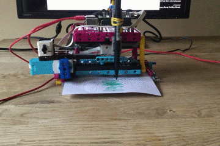

## 介绍

利用乐高（LEGO®）和 Raspberry Pi Build HAT 创建一个数据绘图仪。

### 学习成果

--- no-print ---

--- /no-print ---

--- print-only --- 已完成的数据绘图仪的照片 --- /print-only ---

### 您将会学到什么

+ 如何计算旋转的角度
+ 如何将数据映射到适当的比例以便进行可视化
+ 如何使用条件语句（if/else）

### 硬件

+ 一台树莓派电脑(Raspberry Pi)
+ 一个Raspberry Pi Build HAT
+ 两个乐高（LEGO®）Technic™ 马达
+ 一个乐高（LEGO®）SPIKE™ 压力传感器或按钮、面包板和一些跳线
+ 各种乐高（LEGO®）组件，包括两个小车轮（我们从 [LEGO® Education SPIKE™ Prime 套件](https://education.lego.com/en-gb/product/spike-prime)中选择了一些）
+ 一个带筒形插孔的 7.5V 电源（您也可以改用电池组，但要确保所有电池都充满电）

### 软件

+ Python 3
+ Vcgencmd Python3 库

### 下载

+ [乐高（LEGO®）SPIKE™ Prime 搭建说明： *Track Your Parcels* (1/2)](https://le-www-live-s.legocdn.com/sc/media/lessons/prime/pdf/building-instructions/track-your-packages-bi-pdf-book1of2-05883f81fed73ac3738781d084e0d4e2.pdf){:target="_blank"}
+ [乐高（LEGO®）SPIKE™ Prime 搭建说明： *Track Your Parcels* (2/2)](https://le-www-live-s.legocdn.com/sc/media/lessons/prime/pdf/building-instructions/track-your-packages-bi-pdf-book2of2-80dc3c8c61ec2d2ffa785b688326ef74.pdf){:target="_blank"}
+ [完整的乐高绘图仪项目脚本](http://rpf.io/p/en/lego-plotter-go){:target="_blank"}

--- collapse ---
---
title：安装 Vcgencmd Python 库
---

确保您已连接到互联网。

按下<kbd>Ctrl</kbd>+<kbd>Alt</kbd>+<kbd>T</kbd>，在 Raspberry Pi 上打开一个终端窗口。

在提示符后键入： `sudo pip3 install vcgencmd` 并按 <kbd>回车</kbd>。

等收到确认消息后（不会花费很长时间），关闭终端窗口。

--- /collapse ---

--- collapse ---
---
title: 为教师提供的额外信息
---

您可以在 [此处](http://rpf.io/p/en/projectName-get){:target="_blank"}下载已完成的项目。

如果您需要打印此项目，请使用[适合打印的版本](https://projects.raspberrypi.org/en/projects/projectName/print){:target="_blank"}.

--- /collapse ---

在开始之前，您需要设置好您的 Raspberry Pi 并连接您的 Build HAT：

--- task ---

使用 M2 螺栓和螺母将您的 Raspberry Pi 安装到乐高(LEGO®) Build Plate上，请确保将Raspberry Pi 置于没有“边缘”的一侧：

 

--- /task ---

以这种方式安装 Raspberry Pi 可以轻松访问（Raspberry Pi的）端口和 SD 卡插槽。 Build Plate 可让您更轻松地将 Raspberry Pi 连接到仪表板的主要部件。

--- task ---

将 Build HAT 与 Raspberry Pi 对齐，请确保您可以看到 `This way up` 标签。 确保Build HAT准确滴覆盖了所有的 GPIO 引脚，然后用力按下。 （该示例使用了 [堆叠头](https://www.adafruit.com/product/2223){:target="_blank"}，所以有更长的引脚。）

 

--- /task ---

现在利用 Build HAT 上的 7.5V 桶形插孔为您的 Raspberry Pi 供电，这也将用于驱动马达。

--- task ---

如果您尚未设置您的 Raspberry Pi，请按照以下步骤：

[设置你的Raspberry Pi](https://projects.raspberrypi.org/en/projects/raspberry-pi-setting-up){:target="_blank"}

--- /task ---

--- task ---

Raspberry Pi 启动后，单击 Raspberry 菜单按钮，然后选择“首选项”，然后选择“Raspberry Pi 配置”，打开 Raspberry Pi 配置工具。

单击“interfaces”选项卡并调整串口设置，如下所示：

--- /task ---

--- task ---

您还需要按照以下说明安装 buildhat的 python 库：

--- collapse ---
---
title：安装 buildhat Python 库
---

按下<kbd>Ctrl</kbd>+<kbd>Alt</kbd>+<kbd>T</kbd>，在 Raspberry Pi 上打开一个终端窗口。

在提示符后键入： `sudo pip3 install buildhat`

按 <kbd>回车</kbd> 并等待“installation completed”消息。

--- /collapse ---

--- /task ---
