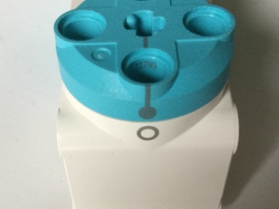

## 依据数据移动马达

您可能在有关地震灾难的电影中看到过使用 [地震仪](https://zh.wikipedia.org/wiki/%E5%9C%B0%E9%9C%87%E5%84%80)  来显示震颤的场景。 

此类设备的设计非常简单：一个马达用于将纸张移过笔的下方（x 轴），而另一个与第一个马达成直角的马达，根据数据的变化来移动笔（y -轴）。 

在本项目中，您将使用乐高（LEGO®）创建一个绘图仪，并将其连接到您的 Raspberry Pi，以便用它来绘制实时数据。

--- task ---

将显示器、键盘和鼠标连接到您的 Raspberry Pi。 如果您以前从未使用过 Raspberry Pi，您可以从 [这个项目](https://projects.raspberrypi.org/zh-CN/projects/raspberry-pi-getting-started)开始。

将 Build HAT 连接到您的 Raspberry Pi（确保您可以看到顶部的 Raspberry Pi 徽标），并通过Build HAT 的筒形插孔链接 7.5V 电源 。 这将启动您的 Raspberry Pi。

--- /task ---

--- task ---

从编程菜单中打开 Thonny，并在您的程序中添加以下命令以导入您将使用的库：

--- code ---
---
language: python 
filename: plotter.py 
line_numbers: true 
line_number_start: 1
line_highlights: 1,2,3
---

from random import randint 
from time import sleep 
from buildhat import Motor

--- /code ---

按 <kbd>Ctrl</kbd>+<kbd>s</kbd>将此程序保存为 `plotter.py`。

--- /task ---

--- task ---

现在使用 `randint` 函数在一个范围内（在本例中为 -180 到 180）创建一个随机值，并将其存储在一个名为 `new_angle`的变量中：

--- code ---
---
language: python 
filename: plotter.py 
line_numbers: true 
line_number_start: 5
line_highlights: 5,6
---

new_angle = randint(-180,180) 
print(new_angle)

--- /code ---

--- /task ---

--- task ---

单击窗口顶部的 **Run** 按钮运行您的程序，并重复几次。 在代码下方的 shell 窗口中，每次运行您应该都会看到不同的值。

--- /task ---

与其手动运行这个脚本，不如创建一个 **loop** 来重复运行该脚本。 要持续运行相同的程序行，您可以使用 `while True:` 循环。

--- task ---

在您刚刚添加的代码上方输入<kbd>回车</kbd>，添加一个空行。

在这个新创建的行上，输入 `while True:`; 确保你的“T”是大写。

--- code ---
---
language: python 
filename: plotter.py 
line_numbers: true 
line_number_start: 5
line_highlights: 5
---

while True: 
new_angle = randint(-180,180) 
print(new_angle)

--- /code ---

--- /task ---

--- task ---

在while下面的每一行代码的开头添加四个空格以创建一个 **缩进块**。 这将会告诉计算机哪些代码行是包含在您的loop循环中。

--- code ---
---
language: python 
filename: plotter.py 
line_numbers: true 
line_number_start: 5
line_highlights: 6,7
---

while True: 
    new_angle = randint(-180,180) 
    print(new_angle)

--- /code ---

--- /task ---

--- task ---

在代码末尾，按 <kbd>回车</kbd> 添加另一个缩进行。 在这一行，输入 `sleep(0.1)`。

--- code ---
---
language: python 
filename: plotter.py 
line_numbers: true 
line_number_start: 5
line_highlights: 8
---

while True: 
    new_angle = randint(-180,180) 
    print(new_angle) 
    sleep(0.1)

--- /code ---

--- /task ---

--- task ---

运行您的代码，在 shell 窗口中查看打印的值。 如果您发现错误，请检查您的代码是否如下所示：

--- code ---
---
language: python 
filename: plotter.py 
line_numbers: true
line_number_start: 1
---

from random import randint 
from time import sleep 
from buildhat import Motor

while True:
    new_angle = randint(-180,180) 
    print(new_angle) 
    sleep(0.1)

--- /code ---

--- /task ---

现在您有了一些数据，您可以使用它来控制马达的位置。

--- task ---

将一个乐高（LEGO®）Technic™马达连接到 Build HAT 上的端口 A。 在马达轴上连接一些额外的乐高（LEGO®）组件，以便轻松看到马达的转动。

--- /task ---

--- task ---

将组件与马达上的标记对齐，然后将马达归零：

--- /task ---

现在，修改您的程序，使马达转动的角度与您模拟的传感器产生的最新值相同。

您将需要设置您的马达，以便使用程序访问。

--- task ---

在 Build HAT 上为端口 `A` 创建一个 `motor_y`对象，并设置马达位置为`0`，设置马达速度为`100`。

--- code ---
---
language: python 
filename: plotter.py 
line_numbers: true 
line_number_start: 4
line_highlights: 5, 6
---

motor_y = Motor('A') 
motor_y.run_to_position(0, 100)

--- /code ---

--- /task ---

--- task ---

下一行程序使马达转到`new_angle`的角度。

--- code ---
---
language: python 
filename: plotter.py 
line_numbers: true 
line_number_start: 7
line_highlights: 11
---

while True: 
    new_angle = randint(-180,180) 
    print(new_angle) 
    motor_y.run_to_position(new_angle, 100)

--- /code ---

--- /task ---

--- task ---

单击 **Run** ，您应该会看到马达顺时针旋转到不同的位置以响应数据的变化。 如果您重新运行程序，马达应该会在再次随机移动之前 `归零`

如果您发现错误，请检查您的代码是否如下所示：

--- code ---
---
language: python 
filename: plotter.py 
line_numbers: true
line_number_start: 1
---

from random import randint 
from time import sleep 
from buildhat import Motor

motor_y = Motor('A') 
motor_y.run_to_position(0, 100)

while True: 
    new_angle = randint(-180,180) 
    print(new_angle) 
    motor_y.run_to_position(new_angle, 100) 
    sleep(0.1)

--- /code ---

--- /task ---

--- save ---
