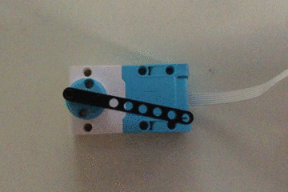
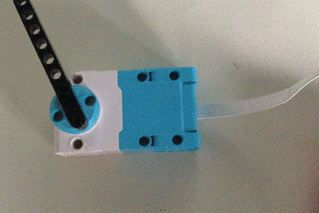

## 创建一个绘图区域

在这一步中，我们将控制马达旋转的方向（顺时针或逆时针），使马达在每个方向都可以达到最大行程点。

--- collapse ---
---
title：为什么需要改变马达的旋转方式
---

您的马达将始终采用最短路径去达新位置。

例如，如果马达目前在 170 度，而下一个位置是 -170 度，那它将按顺时针方向旋转，穿过 180 度的位置，以求尽快到达目的地。

这对我们的模拟环境来说没问题，但是我们的绘图仪并不能这样自由地移动。 一旦画笔到达纸的顶部或底部（y 轴），它就不能继续同向移动以出现在底部或顶部——它将不能运行。 因此，需要防止您的绘图仪在顺时针移动时超过 180 度。

这可以通过改变马达移动到新位置的机制来实现。 您可以通过给 `run_to_position()` 函数赋予额外的 `direction=` 参数来做到这一点。 您可以将此值设置为 `"clockwise"`、 `"anticlockwise"`或 `"shortest"`，”shortest“是默认的行为。

例如， `motor_y.run_to_position(50, 100, direction="antiitarian")` 会以最大速度逆时针转动，将马达转动到 50 度的位置。

可以加入 **条件检查** 以确保电机永远不会经过 180 度，并且在从较高角度移动到较低角度时，始终保持逆时针方向转动。

您可以利用`motor_y.get_aposition`函数找到马达的最后位置。

--- /collapse ---

--- task ---

在`while` 循环的顶部检查马达的当前角度。

--- code ---
---
language: python
filename: plotter.py
line_numbers: true
line_number_start: 7
line_highlights: 8
---

while True:
    current_angle = motor_y.get_aposition()
    new_angle = randint(-180, 180)
    print(new_angle)
    motor_y.run_to_position(new_angle, 100)
    sleep(0.1)

--- /code ---

--- /task ---

--- task ---

现在，在 `while` 循环中，您可以添加检查用以查看 `new_angle` 的值是大于还是小于 `current_angle`的值。

--- code ---
---
language: python
filename: plotter.py
line_numbers: true
line_number_start: 7
line_highlights: 11-16
---

while True:
    current_angle = motor_y.get_aposition()
    new_angle = randint(-180, 180)
    print(new_angle)
    if new_angle > current_angle:
        motor_y.run_to_position(new_angle, 100, direction="clockwise")
        print('Turning CW')
    elif new_angle < current_angle:
        motor_y.run_to_position(new_angle, 100, direction="anticlockwise")
        print('Turning ACW')
    sleep(0.1)

--- /code ---

--- /task ---

--- task ---

运行你的代码。 这些条件测试将防止马达在从负值变为正值时通过 180 度刻度（反之亦然）。

--- /task ---

--- save ---

