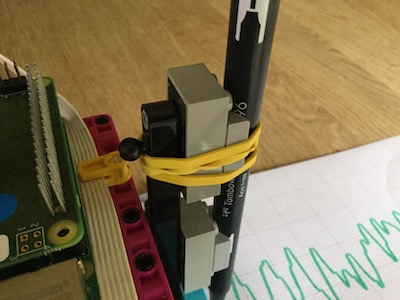

## 搭建绘图仪

在这一步中，您将使用乐高（LEGO®）搭建一个 x/y 绘图仪。

有很多方法可以实现这个设计，但乐高（LEGO®）SPIKE™ Prime *Track Your Parcels* 项目的搭建说明是一个很好的起点。 您可以利用上一步搭建中用于y 轴的（握笔的）马达。

--- task ---

您需要稍微调整设计，以便手臂能够握住笔。 橡皮筋就可以很好地将钢笔和乐高 （LEGO®）紧贴起来。

<embed src="https://le-www-live-s.legocdn.com/sc/media/lessons/prime/pdf/building-instructions/track-your-packages-bi-pdf-book1of2-05883f81fed73ac3738781d084e0d4e2.pdf" width="600" height="500" alt="pdf" pluginspage="http://www.adobe.com/products/acrobat/readstep2.html">
  
 
  
  

    --- /task ---
  

  
  

    构建的第二部分实现了使用两个马达驱动绘图仪的机制。
  

  
  

    
  

  
  

<embed src="https://le-www-live-s.legocdn.com/sc/media/lessons/prime/pdf/building-instructions/track-your-packages-bi-pdf-book2of2-80dc3c8c61ec2d2ffa785b688326ef74.pdf" width="600" height="500" alt="pdf" pluginspage="http://www.adobe.com/products/acrobat/readstep2.html">
      
 
      
      

        --- task ---
      

      
      

        将能够驱动画笔上下运动的乐高（LEGO®）Technic™ 马达连接到 Build HAT 上的端口 A。
      

      
      

        --- /task ---
      

      
      

        现在您可以使用您的模拟数据源来测试您的绘图仪。 目前在观察数据引起的马达运动时，可以盖上笔盖或将画笔取下。
      

<h3 spaces-before="0">
  校准绘图仪
</h3>

  您当前的程序允许马达在其整个运动范围内转动（从零点开始， -180 到 +180 度）。 但是绘图仪的物理限制意味着，如果您试图将齿轨驱动到最大和最小位置时，它会使笔臂撞到构建的其他部分。 为了避免这种情况，您必须将齿条居中。

  --- task ---

  单击Thonny的 <strong x-id="1">Shell 窗格</strong> （代码下方的窗口），这样您就可以一次执行一行 Python代码。

  在<strong x-id="1">Shell</strong>窗口中输入这些行（您可以从上面的程序中复制粘贴它们），在每行之后输入 <kbd>回车</kbd>

<pre><code class="python">&gt;&gt;&gt; from buildhat import Motor
</code></pre>

  按 <kbd>回车</kbd>。

  输入：

<pre><code class="python"> motor_y = Motor('A')
</code></pre>

  按 <kbd>回车</kbd>。

  输入：

<pre><code class="python"> motor_y.run_to_position(0, 100)
</code></pre>

  按 <kbd>回车</kbd>。

  这应该使您的马达 <strong x-id="1">归零</strong>

  --- /task ---

  --- task ---

  调整笔臂的位置，将齿条轻轻推到中间，使画笔与另一个马达对齐。

  

  --- /task ---

  --- save ---

