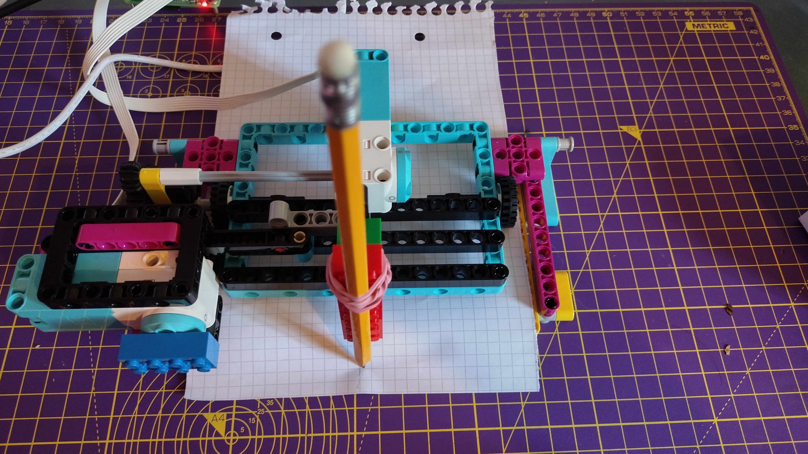

## 进纸

您现在将对第二个马达进行编程，使其以恒定速率为绘图仪送纸。

--- task ---

从后面的小轮子下方送入一张 A5 纸（或将一些废纸切成大约这个尺寸）。



--- /task ---

--- task ---

将（驱动这些轮子的）乐高（LEGO® ）Technic™ 马达接入 Build HAT 上的端口 B。

--- /task ---

--- task ---

在`motor_y`行的下方，相应地为这个马达创建一个名为 `motor_x`的对象 ：

--- code ---
---
language: python
filename: plotter.py
line_numbers: true
line_number_start: 5
line_highlights: 6
---

motor_y = Motor('A')
motor_x = Motor('B')
motor_y.run_to_position(0, 100)

--- /code ---

--- /task ---

--- task ---

在`while True` 循环之前添加一行，以启动此马达：

--- code ---
---
language: python
filename: plotter.py
line_numbers: true
line_number_start: 5
line_highlights: 8
---

motor_y = Motor('A')
motor_x = Motor('B')
motor_y.run_to_position(0, 100)
motor_x.start(-25)

--- /code ---

--- /task ---

这将使供纸马达在程序启动后，以每分钟 -25 转的恒定速率运行。 更改括号中的数字以试验不同速度。

--- task ---

运行您的代码，观察在绘图仪在送出纸张的同时，铅笔在 `y` 方向上随机移动。


--- /task ---

要停止马达送纸，您可以在 **Shell窗口**中键入以下内容。

```python
from buildhat import Motor
motor_x = Motor('B')
motor_x.stop()
```

--- save ---


